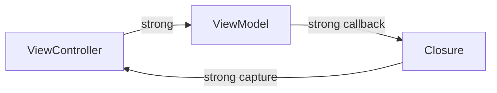

# 09 — ARC Memory Management

ARC questions are really ownership-graph questions.

## Retain cycle diagram


## ARC ownership model
ARC manages the lifetime of class instances.

### Mental model
- Strong references keep an object alive.
- Deallocation occurs when no strong references remain.
- ARC is not the same as tracing garbage collection.

### Example
```swift
final class SessionManager {
    deinit {
        print("SessionManager deallocated")
    }
}

var manager: SessionManager? = SessionManager()
manager = nil
```

## Strong, weak, and unowned references
### Example
```swift
final class Owner {
    var pet: Pet?
}

final class Pet {
    weak var owner: Owner?
}
```

### Quick recall
- Strong retains.
- Weak does not retain and becomes nil.
- Unowned does not retain and traps if accessed after deallocation.

## Retain cycles and closure capture lists
### Example
```swift
final class LoginViewModel {
    var onSuccess: (() -> Void)?

    func bind() {
        onSuccess = { [weak self] in
            self?.trackLogin()
        }
    }

    private func trackLogin() {
        print("Tracked")
    }
}
```

### Common pitfalls
- ⚠️ Adding `[weak self]` everywhere without understanding the graph.
- ⚠️ Using `unowned` when lifetime is not guaranteed.
- ⚠️ Forgetting that cycles can involve more than two nodes.

> 🎯 **Interview Answer:** Start with who owns the closure and what the closure retains back. That graph tells you whether a cycle exists.

## When weak vs unowned crashes vs does not crash
- Weak access after deallocation returns `nil`.
- Unowned access after deallocation traps.
- Async code makes lifetime assumptions harder, so be careful with `unowned` across delayed execution.

## Topic-specific oral drills
Use these prompts to turn **arc memory management** into interview-ready speaking material. Each drill is intentionally specific so you can rehearse definitions, tradeoffs, and production consequences without relying on generic filler.

### Drill 1 — ARC ownership model
- **Definition prompt:** Explain what **ARC ownership model** means in Swift without starting from syntax alone.
- **Mental model prompt:** Describe the simplest accurate mental model for **ARC ownership model**.
- **Why interviewers ask:** They want to see whether you understand the semantics behind **ARC ownership model**, not just the spelling.
- **Production example to mention:** Connect **ARC ownership model** to a real iOS code path such as view state, networking, decoding, ownership, or architecture.
- **Common mistake:** Do not answer **ARC ownership model** as a memorized rule if there is a tradeoff or boundary decision involved.
- **Senior signal:** Mention the invariant, ownership rule, abstraction cost, or maintainability consequence behind **ARC ownership model**.
- **One-line close:** End with a concise summary that tells the interviewer why **ARC ownership model** matters in production code.

### Follow-up 1 — ARC ownership model
- **Compare prompt:** Contrast **ARC ownership model** with the nearby concept candidates most often confuse it with.
- **Pitfall prompt:** Name a bug, crash, leak, or maintainability issue that appears when **ARC ownership model** is misunderstood.
- **Code review angle:** Describe what misuse of **ARC ownership model** would look like in a pull request.
- **Refactor angle:** Explain how you would redesign the code so the correct use of **ARC ownership model** becomes more obvious.
- **Interview follow-up:** Be ready to give one short example and one tradeoff sentence about **ARC ownership model**.

### Drill 2 — strong references
- **Definition prompt:** Explain what **strong references** means in Swift without starting from syntax alone.
- **Mental model prompt:** Describe the simplest accurate mental model for **strong references**.
- **Why interviewers ask:** They want to see whether you understand the semantics behind **strong references**, not just the spelling.
- **Production example to mention:** Connect **strong references** to a real iOS code path such as view state, networking, decoding, ownership, or architecture.
- **Common mistake:** Do not answer **strong references** as a memorized rule if there is a tradeoff or boundary decision involved.
- **Senior signal:** Mention the invariant, ownership rule, abstraction cost, or maintainability consequence behind **strong references**.
- **One-line close:** End with a concise summary that tells the interviewer why **strong references** matters in production code.

### Follow-up 2 — strong references
- **Compare prompt:** Contrast **strong references** with the nearby concept candidates most often confuse it with.
- **Pitfall prompt:** Name a bug, crash, leak, or maintainability issue that appears when **strong references** is misunderstood.
- **Code review angle:** Describe what misuse of **strong references** would look like in a pull request.
- **Refactor angle:** Explain how you would redesign the code so the correct use of **strong references** becomes more obvious.
- **Interview follow-up:** Be ready to give one short example and one tradeoff sentence about **strong references**.

### Drill 3 — weak references
- **Definition prompt:** Explain what **weak references** means in Swift without starting from syntax alone.
- **Mental model prompt:** Describe the simplest accurate mental model for **weak references**.
- **Why interviewers ask:** They want to see whether you understand the semantics behind **weak references**, not just the spelling.
- **Production example to mention:** Connect **weak references** to a real iOS code path such as view state, networking, decoding, ownership, or architecture.
- **Common mistake:** Do not answer **weak references** as a memorized rule if there is a tradeoff or boundary decision involved.
- **Senior signal:** Mention the invariant, ownership rule, abstraction cost, or maintainability consequence behind **weak references**.
- **One-line close:** End with a concise summary that tells the interviewer why **weak references** matters in production code.

### Follow-up 3 — weak references
- **Compare prompt:** Contrast **weak references** with the nearby concept candidates most often confuse it with.
- **Pitfall prompt:** Name a bug, crash, leak, or maintainability issue that appears when **weak references** is misunderstood.
- **Code review angle:** Describe what misuse of **weak references** would look like in a pull request.
- **Refactor angle:** Explain how you would redesign the code so the correct use of **weak references** becomes more obvious.
- **Interview follow-up:** Be ready to give one short example and one tradeoff sentence about **weak references**.

### Drill 4 — unowned references
- **Definition prompt:** Explain what **unowned references** means in Swift without starting from syntax alone.
- **Mental model prompt:** Describe the simplest accurate mental model for **unowned references**.
- **Why interviewers ask:** They want to see whether you understand the semantics behind **unowned references**, not just the spelling.
- **Production example to mention:** Connect **unowned references** to a real iOS code path such as view state, networking, decoding, ownership, or architecture.
- **Common mistake:** Do not answer **unowned references** as a memorized rule if there is a tradeoff or boundary decision involved.
- **Senior signal:** Mention the invariant, ownership rule, abstraction cost, or maintainability consequence behind **unowned references**.
- **One-line close:** End with a concise summary that tells the interviewer why **unowned references** matters in production code.

### Follow-up 4 — unowned references
- **Compare prompt:** Contrast **unowned references** with the nearby concept candidates most often confuse it with.
- **Pitfall prompt:** Name a bug, crash, leak, or maintainability issue that appears when **unowned references** is misunderstood.
- **Code review angle:** Describe what misuse of **unowned references** would look like in a pull request.
- **Refactor angle:** Explain how you would redesign the code so the correct use of **unowned references** becomes more obvious.
- **Interview follow-up:** Be ready to give one short example and one tradeoff sentence about **unowned references**.

### Drill 5 — reference graphs
- **Definition prompt:** Explain what **reference graphs** means in Swift without starting from syntax alone.
- **Mental model prompt:** Describe the simplest accurate mental model for **reference graphs**.
- **Why interviewers ask:** They want to see whether you understand the semantics behind **reference graphs**, not just the spelling.
- **Production example to mention:** Connect **reference graphs** to a real iOS code path such as view state, networking, decoding, ownership, or architecture.
- **Common mistake:** Do not answer **reference graphs** as a memorized rule if there is a tradeoff or boundary decision involved.
- **Senior signal:** Mention the invariant, ownership rule, abstraction cost, or maintainability consequence behind **reference graphs**.
- **One-line close:** End with a concise summary that tells the interviewer why **reference graphs** matters in production code.

### Follow-up 5 — reference graphs
- **Compare prompt:** Contrast **reference graphs** with the nearby concept candidates most often confuse it with.
- **Pitfall prompt:** Name a bug, crash, leak, or maintainability issue that appears when **reference graphs** is misunderstood.
- **Code review angle:** Describe what misuse of **reference graphs** would look like in a pull request.
- **Refactor angle:** Explain how you would redesign the code so the correct use of **reference graphs** becomes more obvious.
- **Interview follow-up:** Be ready to give one short example and one tradeoff sentence about **reference graphs**.

### Drill 6 — retain cycles
- **Definition prompt:** Explain what **retain cycles** means in Swift without starting from syntax alone.
- **Mental model prompt:** Describe the simplest accurate mental model for **retain cycles**.
- **Why interviewers ask:** They want to see whether you understand the semantics behind **retain cycles**, not just the spelling.
- **Production example to mention:** Connect **retain cycles** to a real iOS code path such as view state, networking, decoding, ownership, or architecture.
- **Common mistake:** Do not answer **retain cycles** as a memorized rule if there is a tradeoff or boundary decision involved.
- **Senior signal:** Mention the invariant, ownership rule, abstraction cost, or maintainability consequence behind **retain cycles**.
- **One-line close:** End with a concise summary that tells the interviewer why **retain cycles** matters in production code.

### Follow-up 6 — retain cycles
- **Compare prompt:** Contrast **retain cycles** with the nearby concept candidates most often confuse it with.
- **Pitfall prompt:** Name a bug, crash, leak, or maintainability issue that appears when **retain cycles** is misunderstood.
- **Code review angle:** Describe what misuse of **retain cycles** would look like in a pull request.
- **Refactor angle:** Explain how you would redesign the code so the correct use of **retain cycles** becomes more obvious.
- **Interview follow-up:** Be ready to give one short example and one tradeoff sentence about **retain cycles**.

### Drill 7 — closure capture cycles
- **Definition prompt:** Explain what **closure capture cycles** means in Swift without starting from syntax alone.
- **Mental model prompt:** Describe the simplest accurate mental model for **closure capture cycles**.
- **Why interviewers ask:** They want to see whether you understand the semantics behind **closure capture cycles**, not just the spelling.
- **Production example to mention:** Connect **closure capture cycles** to a real iOS code path such as view state, networking, decoding, ownership, or architecture.
- **Common mistake:** Do not answer **closure capture cycles** as a memorized rule if there is a tradeoff or boundary decision involved.
- **Senior signal:** Mention the invariant, ownership rule, abstraction cost, or maintainability consequence behind **closure capture cycles**.
- **One-line close:** End with a concise summary that tells the interviewer why **closure capture cycles** matters in production code.

### Follow-up 7 — closure capture cycles
- **Compare prompt:** Contrast **closure capture cycles** with the nearby concept candidates most often confuse it with.
- **Pitfall prompt:** Name a bug, crash, leak, or maintainability issue that appears when **closure capture cycles** is misunderstood.
- **Code review angle:** Describe what misuse of **closure capture cycles** would look like in a pull request.
- **Refactor angle:** Explain how you would redesign the code so the correct use of **closure capture cycles** becomes more obvious.
- **Interview follow-up:** Be ready to give one short example and one tradeoff sentence about **closure capture cycles**.

### Drill 8 — view controller to view model cycles
- **Definition prompt:** Explain what **view controller to view model cycles** means in Swift without starting from syntax alone.
- **Mental model prompt:** Describe the simplest accurate mental model for **view controller to view model cycles**.
- **Why interviewers ask:** They want to see whether you understand the semantics behind **view controller to view model cycles**, not just the spelling.
- **Production example to mention:** Connect **view controller to view model cycles** to a real iOS code path such as view state, networking, decoding, ownership, or architecture.
- **Common mistake:** Do not answer **view controller to view model cycles** as a memorized rule if there is a tradeoff or boundary decision involved.
- **Senior signal:** Mention the invariant, ownership rule, abstraction cost, or maintainability consequence behind **view controller to view model cycles**.
- **One-line close:** End with a concise summary that tells the interviewer why **view controller to view model cycles** matters in production code.

### Follow-up 8 — view controller to view model cycles
- **Compare prompt:** Contrast **view controller to view model cycles** with the nearby concept candidates most often confuse it with.
- **Pitfall prompt:** Name a bug, crash, leak, or maintainability issue that appears when **view controller to view model cycles** is misunderstood.
- **Code review angle:** Describe what misuse of **view controller to view model cycles** would look like in a pull request.
- **Refactor angle:** Explain how you would redesign the code so the correct use of **view controller to view model cycles** becomes more obvious.
- **Interview follow-up:** Be ready to give one short example and one tradeoff sentence about **view controller to view model cycles**.

### Drill 9 — delegate ownership
- **Definition prompt:** Explain what **delegate ownership** means in Swift without starting from syntax alone.
- **Mental model prompt:** Describe the simplest accurate mental model for **delegate ownership**.
- **Why interviewers ask:** They want to see whether you understand the semantics behind **delegate ownership**, not just the spelling.
- **Production example to mention:** Connect **delegate ownership** to a real iOS code path such as view state, networking, decoding, ownership, or architecture.
- **Common mistake:** Do not answer **delegate ownership** as a memorized rule if there is a tradeoff or boundary decision involved.
- **Senior signal:** Mention the invariant, ownership rule, abstraction cost, or maintainability consequence behind **delegate ownership**.
- **One-line close:** End with a concise summary that tells the interviewer why **delegate ownership** matters in production code.

### Follow-up 9 — delegate ownership
- **Compare prompt:** Contrast **delegate ownership** with the nearby concept candidates most often confuse it with.
- **Pitfall prompt:** Name a bug, crash, leak, or maintainability issue that appears when **delegate ownership** is misunderstood.
- **Code review angle:** Describe what misuse of **delegate ownership** would look like in a pull request.
- **Refactor angle:** Explain how you would redesign the code so the correct use of **delegate ownership** becomes more obvious.
- **Interview follow-up:** Be ready to give one short example and one tradeoff sentence about **delegate ownership**.

### Drill 10 — parent-child lifetime guarantees
- **Definition prompt:** Explain what **parent-child lifetime guarantees** means in Swift without starting from syntax alone.
- **Mental model prompt:** Describe the simplest accurate mental model for **parent-child lifetime guarantees**.
- **Why interviewers ask:** They want to see whether you understand the semantics behind **parent-child lifetime guarantees**, not just the spelling.
- **Production example to mention:** Connect **parent-child lifetime guarantees** to a real iOS code path such as view state, networking, decoding, ownership, or architecture.
- **Common mistake:** Do not answer **parent-child lifetime guarantees** as a memorized rule if there is a tradeoff or boundary decision involved.
- **Senior signal:** Mention the invariant, ownership rule, abstraction cost, or maintainability consequence behind **parent-child lifetime guarantees**.
- **One-line close:** End with a concise summary that tells the interviewer why **parent-child lifetime guarantees** matters in production code.

### Follow-up 10 — parent-child lifetime guarantees
- **Compare prompt:** Contrast **parent-child lifetime guarantees** with the nearby concept candidates most often confuse it with.
- **Pitfall prompt:** Name a bug, crash, leak, or maintainability issue that appears when **parent-child lifetime guarantees** is misunderstood.
- **Code review angle:** Describe what misuse of **parent-child lifetime guarantees** would look like in a pull request.
- **Refactor angle:** Explain how you would redesign the code so the correct use of **parent-child lifetime guarantees** becomes more obvious.
- **Interview follow-up:** Be ready to give one short example and one tradeoff sentence about **parent-child lifetime guarantees**.

### Drill 11 — weak vs unowned choice
- **Definition prompt:** Explain what **weak vs unowned choice** means in Swift without starting from syntax alone.
- **Mental model prompt:** Describe the simplest accurate mental model for **weak vs unowned choice**.
- **Why interviewers ask:** They want to see whether you understand the semantics behind **weak vs unowned choice**, not just the spelling.
- **Production example to mention:** Connect **weak vs unowned choice** to a real iOS code path such as view state, networking, decoding, ownership, or architecture.
- **Common mistake:** Do not answer **weak vs unowned choice** as a memorized rule if there is a tradeoff or boundary decision involved.
- **Senior signal:** Mention the invariant, ownership rule, abstraction cost, or maintainability consequence behind **weak vs unowned choice**.
- **One-line close:** End with a concise summary that tells the interviewer why **weak vs unowned choice** matters in production code.

### Follow-up 11 — weak vs unowned choice
- **Compare prompt:** Contrast **weak vs unowned choice** with the nearby concept candidates most often confuse it with.
- **Pitfall prompt:** Name a bug, crash, leak, or maintainability issue that appears when **weak vs unowned choice** is misunderstood.
- **Code review angle:** Describe what misuse of **weak vs unowned choice** would look like in a pull request.
- **Refactor angle:** Explain how you would redesign the code so the correct use of **weak vs unowned choice** becomes more obvious.
- **Interview follow-up:** Be ready to give one short example and one tradeoff sentence about **weak vs unowned choice**.

### Drill 12 — crash behavior of unowned
- **Definition prompt:** Explain what **crash behavior of unowned** means in Swift without starting from syntax alone.
- **Mental model prompt:** Describe the simplest accurate mental model for **crash behavior of unowned**.
- **Why interviewers ask:** They want to see whether you understand the semantics behind **crash behavior of unowned**, not just the spelling.
- **Production example to mention:** Connect **crash behavior of unowned** to a real iOS code path such as view state, networking, decoding, ownership, or architecture.
- **Common mistake:** Do not answer **crash behavior of unowned** as a memorized rule if there is a tradeoff or boundary decision involved.
- **Senior signal:** Mention the invariant, ownership rule, abstraction cost, or maintainability consequence behind **crash behavior of unowned**.
- **One-line close:** End with a concise summary that tells the interviewer why **crash behavior of unowned** matters in production code.

### Follow-up 12 — crash behavior of unowned
- **Compare prompt:** Contrast **crash behavior of unowned** with the nearby concept candidates most often confuse it with.
- **Pitfall prompt:** Name a bug, crash, leak, or maintainability issue that appears when **crash behavior of unowned** is misunderstood.
- **Code review angle:** Describe what misuse of **crash behavior of unowned** would look like in a pull request.
- **Refactor angle:** Explain how you would redesign the code so the correct use of **crash behavior of unowned** becomes more obvious.
- **Interview follow-up:** Be ready to give one short example and one tradeoff sentence about **crash behavior of unowned**.

### Drill 13 — auto-niling of weak
- **Definition prompt:** Explain what **auto-niling of weak** means in Swift without starting from syntax alone.
- **Mental model prompt:** Describe the simplest accurate mental model for **auto-niling of weak**.
- **Why interviewers ask:** They want to see whether you understand the semantics behind **auto-niling of weak**, not just the spelling.
- **Production example to mention:** Connect **auto-niling of weak** to a real iOS code path such as view state, networking, decoding, ownership, or architecture.
- **Common mistake:** Do not answer **auto-niling of weak** as a memorized rule if there is a tradeoff or boundary decision involved.
- **Senior signal:** Mention the invariant, ownership rule, abstraction cost, or maintainability consequence behind **auto-niling of weak**.
- **One-line close:** End with a concise summary that tells the interviewer why **auto-niling of weak** matters in production code.

### Follow-up 13 — auto-niling of weak
- **Compare prompt:** Contrast **auto-niling of weak** with the nearby concept candidates most often confuse it with.
- **Pitfall prompt:** Name a bug, crash, leak, or maintainability issue that appears when **auto-niling of weak** is misunderstood.
- **Code review angle:** Describe what misuse of **auto-niling of weak** would look like in a pull request.
- **Refactor angle:** Explain how you would redesign the code so the correct use of **auto-niling of weak** becomes more obvious.
- **Interview follow-up:** Be ready to give one short example and one tradeoff sentence about **auto-niling of weak**.

### Drill 14 — deinitialization signals
- **Definition prompt:** Explain what **deinitialization signals** means in Swift without starting from syntax alone.
- **Mental model prompt:** Describe the simplest accurate mental model for **deinitialization signals**.
- **Why interviewers ask:** They want to see whether you understand the semantics behind **deinitialization signals**, not just the spelling.
- **Production example to mention:** Connect **deinitialization signals** to a real iOS code path such as view state, networking, decoding, ownership, or architecture.
- **Common mistake:** Do not answer **deinitialization signals** as a memorized rule if there is a tradeoff or boundary decision involved.
- **Senior signal:** Mention the invariant, ownership rule, abstraction cost, or maintainability consequence behind **deinitialization signals**.
- **One-line close:** End with a concise summary that tells the interviewer why **deinitialization signals** matters in production code.

### Follow-up 14 — deinitialization signals
- **Compare prompt:** Contrast **deinitialization signals** with the nearby concept candidates most often confuse it with.
- **Pitfall prompt:** Name a bug, crash, leak, or maintainability issue that appears when **deinitialization signals** is misunderstood.
- **Code review angle:** Describe what misuse of **deinitialization signals** would look like in a pull request.
- **Refactor angle:** Explain how you would redesign the code so the correct use of **deinitialization signals** becomes more obvious.
- **Interview follow-up:** Be ready to give one short example and one tradeoff sentence about **deinitialization signals**.

### Drill 15 — debugging leaks
- **Definition prompt:** Explain what **debugging leaks** means in Swift without starting from syntax alone.
- **Mental model prompt:** Describe the simplest accurate mental model for **debugging leaks**.
- **Why interviewers ask:** They want to see whether you understand the semantics behind **debugging leaks**, not just the spelling.
- **Production example to mention:** Connect **debugging leaks** to a real iOS code path such as view state, networking, decoding, ownership, or architecture.
- **Common mistake:** Do not answer **debugging leaks** as a memorized rule if there is a tradeoff or boundary decision involved.
- **Senior signal:** Mention the invariant, ownership rule, abstraction cost, or maintainability consequence behind **debugging leaks**.
- **One-line close:** End with a concise summary that tells the interviewer why **debugging leaks** matters in production code.

### Follow-up 15 — debugging leaks
- **Compare prompt:** Contrast **debugging leaks** with the nearby concept candidates most often confuse it with.
- **Pitfall prompt:** Name a bug, crash, leak, or maintainability issue that appears when **debugging leaks** is misunderstood.
- **Code review angle:** Describe what misuse of **debugging leaks** would look like in a pull request.
- **Refactor angle:** Explain how you would redesign the code so the correct use of **debugging leaks** becomes more obvious.
- **Interview follow-up:** Be ready to give one short example and one tradeoff sentence about **debugging leaks**.

### Drill 16 — Instruments mental model
- **Definition prompt:** Explain what **Instruments mental model** means in Swift without starting from syntax alone.
- **Mental model prompt:** Describe the simplest accurate mental model for **Instruments mental model**.
- **Why interviewers ask:** They want to see whether you understand the semantics behind **Instruments mental model**, not just the spelling.
- **Production example to mention:** Connect **Instruments mental model** to a real iOS code path such as view state, networking, decoding, ownership, or architecture.
- **Common mistake:** Do not answer **Instruments mental model** as a memorized rule if there is a tradeoff or boundary decision involved.
- **Senior signal:** Mention the invariant, ownership rule, abstraction cost, or maintainability consequence behind **Instruments mental model**.
- **One-line close:** End with a concise summary that tells the interviewer why **Instruments mental model** matters in production code.

### Follow-up 16 — Instruments mental model
- **Compare prompt:** Contrast **Instruments mental model** with the nearby concept candidates most often confuse it with.
- **Pitfall prompt:** Name a bug, crash, leak, or maintainability issue that appears when **Instruments mental model** is misunderstood.
- **Code review angle:** Describe what misuse of **Instruments mental model** would look like in a pull request.
- **Refactor angle:** Explain how you would redesign the code so the correct use of **Instruments mental model** becomes more obvious.
- **Interview follow-up:** Be ready to give one short example and one tradeoff sentence about **Instruments mental model**.

### Drill 17 — stored callback pitfalls
- **Definition prompt:** Explain what **stored callback pitfalls** means in Swift without starting from syntax alone.
- **Mental model prompt:** Describe the simplest accurate mental model for **stored callback pitfalls**.
- **Why interviewers ask:** They want to see whether you understand the semantics behind **stored callback pitfalls**, not just the spelling.
- **Production example to mention:** Connect **stored callback pitfalls** to a real iOS code path such as view state, networking, decoding, ownership, or architecture.
- **Common mistake:** Do not answer **stored callback pitfalls** as a memorized rule if there is a tradeoff or boundary decision involved.
- **Senior signal:** Mention the invariant, ownership rule, abstraction cost, or maintainability consequence behind **stored callback pitfalls**.
- **One-line close:** End with a concise summary that tells the interviewer why **stored callback pitfalls** matters in production code.

### Follow-up 17 — stored callback pitfalls
- **Compare prompt:** Contrast **stored callback pitfalls** with the nearby concept candidates most often confuse it with.
- **Pitfall prompt:** Name a bug, crash, leak, or maintainability issue that appears when **stored callback pitfalls** is misunderstood.
- **Code review angle:** Describe what misuse of **stored callback pitfalls** would look like in a pull request.
- **Refactor angle:** Explain how you would redesign the code so the correct use of **stored callback pitfalls** becomes more obvious.
- **Interview follow-up:** Be ready to give one short example and one tradeoff sentence about **stored callback pitfalls**.

### Drill 18 — async lifetime changes
- **Definition prompt:** Explain what **async lifetime changes** means in Swift without starting from syntax alone.
- **Mental model prompt:** Describe the simplest accurate mental model for **async lifetime changes**.
- **Why interviewers ask:** They want to see whether you understand the semantics behind **async lifetime changes**, not just the spelling.
- **Production example to mention:** Connect **async lifetime changes** to a real iOS code path such as view state, networking, decoding, ownership, or architecture.
- **Common mistake:** Do not answer **async lifetime changes** as a memorized rule if there is a tradeoff or boundary decision involved.
- **Senior signal:** Mention the invariant, ownership rule, abstraction cost, or maintainability consequence behind **async lifetime changes**.
- **One-line close:** End with a concise summary that tells the interviewer why **async lifetime changes** matters in production code.

### Follow-up 18 — async lifetime changes
- **Compare prompt:** Contrast **async lifetime changes** with the nearby concept candidates most often confuse it with.
- **Pitfall prompt:** Name a bug, crash, leak, or maintainability issue that appears when **async lifetime changes** is misunderstood.
- **Code review angle:** Describe what misuse of **async lifetime changes** would look like in a pull request.
- **Refactor angle:** Explain how you would redesign the code so the correct use of **async lifetime changes** becomes more obvious.
- **Interview follow-up:** Be ready to give one short example and one tradeoff sentence about **async lifetime changes**.

### Drill 19 — capture lists
- **Definition prompt:** Explain what **capture lists** means in Swift without starting from syntax alone.
- **Mental model prompt:** Describe the simplest accurate mental model for **capture lists**.
- **Why interviewers ask:** They want to see whether you understand the semantics behind **capture lists**, not just the spelling.
- **Production example to mention:** Connect **capture lists** to a real iOS code path such as view state, networking, decoding, ownership, or architecture.
- **Common mistake:** Do not answer **capture lists** as a memorized rule if there is a tradeoff or boundary decision involved.
- **Senior signal:** Mention the invariant, ownership rule, abstraction cost, or maintainability consequence behind **capture lists**.
- **One-line close:** End with a concise summary that tells the interviewer why **capture lists** matters in production code.

### Follow-up 19 — capture lists
- **Compare prompt:** Contrast **capture lists** with the nearby concept candidates most often confuse it with.
- **Pitfall prompt:** Name a bug, crash, leak, or maintainability issue that appears when **capture lists** is misunderstood.
- **Code review angle:** Describe what misuse of **capture lists** would look like in a pull request.
- **Refactor angle:** Explain how you would redesign the code so the correct use of **capture lists** becomes more obvious.
- **Interview follow-up:** Be ready to give one short example and one tradeoff sentence about **capture lists**.

### Drill 20 — breaking long reference chains
- **Definition prompt:** Explain what **breaking long reference chains** means in Swift without starting from syntax alone.
- **Mental model prompt:** Describe the simplest accurate mental model for **breaking long reference chains**.
- **Why interviewers ask:** They want to see whether you understand the semantics behind **breaking long reference chains**, not just the spelling.
- **Production example to mention:** Connect **breaking long reference chains** to a real iOS code path such as view state, networking, decoding, ownership, or architecture.
- **Common mistake:** Do not answer **breaking long reference chains** as a memorized rule if there is a tradeoff or boundary decision involved.
- **Senior signal:** Mention the invariant, ownership rule, abstraction cost, or maintainability consequence behind **breaking long reference chains**.
- **One-line close:** End with a concise summary that tells the interviewer why **breaking long reference chains** matters in production code.

### Follow-up 20 — breaking long reference chains
- **Compare prompt:** Contrast **breaking long reference chains** with the nearby concept candidates most often confuse it with.
- **Pitfall prompt:** Name a bug, crash, leak, or maintainability issue that appears when **breaking long reference chains** is misunderstood.
- **Code review angle:** Describe what misuse of **breaking long reference chains** would look like in a pull request.
- **Refactor angle:** Explain how you would redesign the code so the correct use of **breaking long reference chains** becomes more obvious.
- **Interview follow-up:** Be ready to give one short example and one tradeoff sentence about **breaking long reference chains**.

### Drill 21 — ownership in architecture
- **Definition prompt:** Explain what **ownership in architecture** means in Swift without starting from syntax alone.
- **Mental model prompt:** Describe the simplest accurate mental model for **ownership in architecture**.
- **Why interviewers ask:** They want to see whether you understand the semantics behind **ownership in architecture**, not just the spelling.
- **Production example to mention:** Connect **ownership in architecture** to a real iOS code path such as view state, networking, decoding, ownership, or architecture.
- **Common mistake:** Do not answer **ownership in architecture** as a memorized rule if there is a tradeoff or boundary decision involved.
- **Senior signal:** Mention the invariant, ownership rule, abstraction cost, or maintainability consequence behind **ownership in architecture**.
- **One-line close:** End with a concise summary that tells the interviewer why **ownership in architecture** matters in production code.

### Follow-up 21 — ownership in architecture
- **Compare prompt:** Contrast **ownership in architecture** with the nearby concept candidates most often confuse it with.
- **Pitfall prompt:** Name a bug, crash, leak, or maintainability issue that appears when **ownership in architecture** is misunderstood.
- **Code review angle:** Describe what misuse of **ownership in architecture** would look like in a pull request.
- **Refactor angle:** Explain how you would redesign the code so the correct use of **ownership in architecture** becomes more obvious.
- **Interview follow-up:** Be ready to give one short example and one tradeoff sentence about **ownership in architecture**.

### Drill 22 — how to explain ARC in interviews
- **Definition prompt:** Explain what **how to explain ARC in interviews** means in Swift without starting from syntax alone.
- **Mental model prompt:** Describe the simplest accurate mental model for **how to explain ARC in interviews**.
- **Why interviewers ask:** They want to see whether you understand the semantics behind **how to explain ARC in interviews**, not just the spelling.
- **Production example to mention:** Connect **how to explain ARC in interviews** to a real iOS code path such as view state, networking, decoding, ownership, or architecture.
- **Common mistake:** Do not answer **how to explain ARC in interviews** as a memorized rule if there is a tradeoff or boundary decision involved.
- **Senior signal:** Mention the invariant, ownership rule, abstraction cost, or maintainability consequence behind **how to explain ARC in interviews**.
- **One-line close:** End with a concise summary that tells the interviewer why **how to explain ARC in interviews** matters in production code.

### Follow-up 22 — how to explain ARC in interviews
- **Compare prompt:** Contrast **how to explain ARC in interviews** with the nearby concept candidates most often confuse it with.
- **Pitfall prompt:** Name a bug, crash, leak, or maintainability issue that appears when **how to explain ARC in interviews** is misunderstood.
- **Code review angle:** Describe what misuse of **how to explain ARC in interviews** would look like in a pull request.
- **Refactor angle:** Explain how you would redesign the code so the correct use of **how to explain ARC in interviews** becomes more obvious.
- **Interview follow-up:** Be ready to give one short example and one tradeoff sentence about **how to explain ARC in interviews**.

