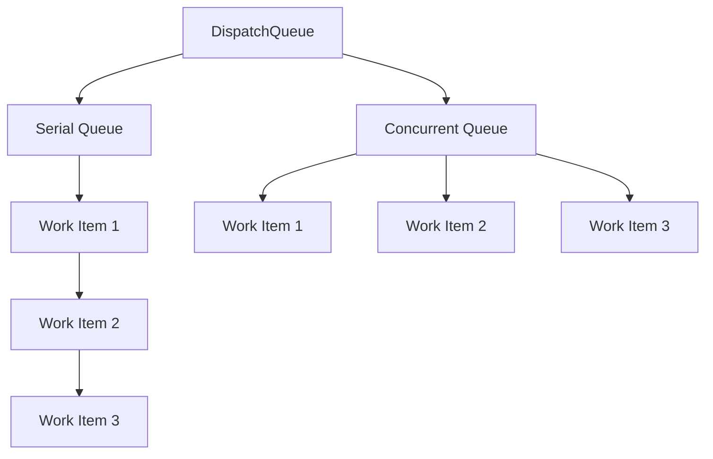
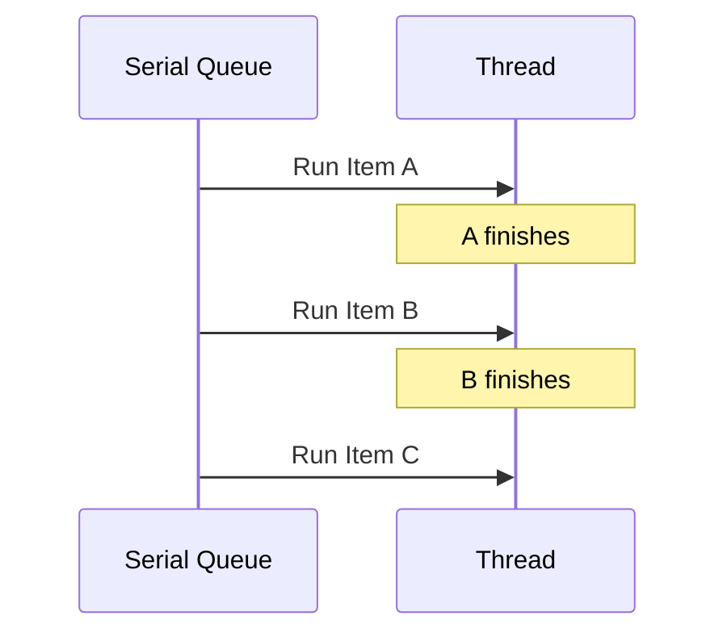
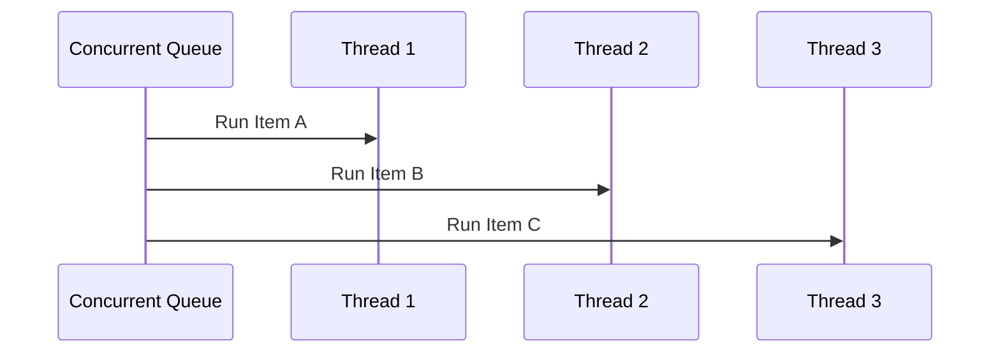
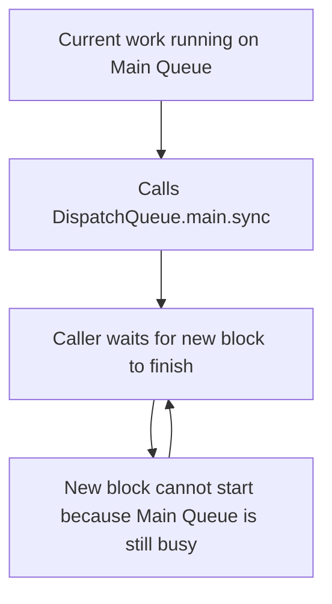

# 01 — Threads, GCD, Queues, and Deadlocks

This file covers the execution model that predates Swift structured concurrency and still powers a huge amount of iOS production code.
You need this knowledge even if your current code mostly uses `async` and `await`.
Interviewers often start with GCD because it reveals whether your mental model is operational or slogan-based.

## Learning goals

By the end of this file you should be able to:

- Explain threads versus tasks clearly.
- Explain what Grand Central Dispatch actually does.
- Compare serial and concurrent queues.
- Compare synchronous and asynchronous dispatch.
- Explain common deadlocks.
- Use DispatchGroup and DispatchSemaphore carefully.
- Explain OperationQueue and when it is still useful.
- Speak about QoS levels with production context.

## The core mental model

A thread is an execution resource.
A queue is a scheduling abstraction.
A task or work item is the unit of work you submit.
GCD decides how to map submitted work onto available threads.

### Threads versus tasks

A thread owns execution state such as a stack.
Creating and switching between threads has cost.
Too many threads can waste memory and CPU time on scheduling overhead.

A task is a unit of work.
Different systems use different terms.
In GCD, you usually submit a closure as a work item.
In Swift concurrency, you create a `Task`.
The important idea is that tasks are scheduled onto threads.
They are not threads themselves.

> 🎯 **Interview Answer:** “I treat threads as execution resources and tasks as work descriptions. Good concurrency design usually means creating the right amount of work and letting the runtime schedule it, rather than micromanaging threads.”

## Why GCD exists

Before GCD, developers often created threads manually.
That was error-prone and difficult to tune.
GCD provides queues and a system-managed thread pool.
It lets you describe work and quality-of-service rather than directly managing thread lifecycles.

GCD is built around a few big ideas:

- Submit work to queues.
- Separate *what* should run from *where* it physically runs.
- Let the system optimize scheduling.
- Use serial execution when you need ordering.
- Use concurrent execution when independent work can overlap.

## DispatchQueue basics

`DispatchQueue` is the primary API you interact with.
A queue can be serial or concurrent.
You submit closures to it with methods such as `async` and `sync`.

### The main queue

The main queue is a serial queue associated with the main thread.
UIKit work must generally happen on the main queue.
User input, layout, drawing coordination, and many framework callbacks are expected there.
Blocking it hurts responsiveness.

### A custom serial queue

A serial queue executes one submitted work item at a time.
That does not necessarily mean it uses only one physical thread forever.
It means only one item from that queue is active at once.
This gives you ordering and a simple isolation mechanism.

### A custom concurrent queue

A concurrent queue can start multiple work items at the same time.
Submission order is preserved.
Completion order is not guaranteed.
Barrier operations can be used to create exclusive phases on custom concurrent queues.

## Mermaid diagram — queue types



## Mermaid diagram — serial execution



## Mermaid diagram — concurrent execution



## Sync versus async

These terms describe the submission behavior of the caller.
They do not directly describe whether the work is on a background thread.

### `async`

`async` means submit the work and return immediately.
The caller does not wait for completion.
This is non-blocking with respect to the caller.

### `sync`

`sync` means submit the work and block the caller until that work finishes.
The work may execute immediately or later depending on the queue.
The caller waits.
That is the key property.

> 💡 **Tip:** In interviews, say “sync blocks the current execution context until completion” instead of “sync means same thread.” The latter is often wrong or incomplete.

## Basic examples

```swift
import Foundation

let serialQueue = DispatchQueue(label: "com.bootcamp.serial")
let concurrentQueue = DispatchQueue(label: "com.bootcamp.concurrent", attributes: .concurrent)

serialQueue.async {
    print("Serial async work")
}

concurrentQueue.async {
    print("Concurrent async work")
}

serialQueue.sync {
    print("This blocks the caller until done")
}
```

## A practical example — protecting mutable state with a serial queue

```swift
import Foundation

final class LegacyImageCache {
    private let queue = DispatchQueue(label: "com.bootcamp.image-cache")
    private var storage: [URL: Data] = [:]

    func data(for url: URL) -> Data? {
        queue.sync {
            storage[url]
        }
    }

    func insert(_ data: Data, for url: URL) {
        queue.async {
            self.storage[url] = data
        }
    }

    func removeValue(for url: URL) {
        queue.async {
            self.storage.removeValue(forKey: url)
        }
    }
}
```

This pattern is common in older codebases.
Reads use `sync` so callers get a value back immediately.
Writes use `async` so callers are not blocked.
It works.
It also has tradeoffs.
Write ordering is preserved, but async writes are not immediately visible to a caller that races ahead.

> ⚠️ **Pitfall:** A serial queue can serialize access, but it does not automatically make API semantics obvious. Be explicit about whether writes are fire-and-forget or completion-observed.

## Concurrent queues with barriers

Custom concurrent queues can often improve read-heavy workloads.
Multiple reads can happen concurrently.
Writes can use `.barrier` to make the mutation exclusive.

```swift
import Foundation

final class ReadMostlyCache {
    private let queue = DispatchQueue(label: "com.bootcamp.read-mostly-cache", attributes: .concurrent)
    private var storage: [String: Int] = [:]

    func value(for key: String) -> Int? {
        queue.sync {
            storage[key]
        }
    }

    func setValue(_ value: Int, for key: String) {
        queue.async(flags: .barrier) {
            self.storage[key] = value
        }
    }

    func removeAll() {
        queue.async(flags: .barrier) {
            self.storage.removeAll()
        }
    }
}
```

This is a classic interview discussion point.
It shows you understand how to separate read concurrency from write exclusivity.

## Deadlock fundamentals

A deadlock happens when progress becomes impossible because each side waits for the other.
With GCD, deadlocks often occur when synchronous dispatch is used carelessly.
The most famous example is synchronously dispatching onto the same serial queue you are already executing on.

### Main queue deadlock

```swift
DispatchQueue.main.sync {
    print("Never do this from code already on the main queue")
}
```

If the current execution context is already on the main queue, this call waits for the main queue block to finish.
But the main queue cannot start that block because it is busy with the current work.
So both sides wait forever.

## Mermaid diagram — self-deadlock on a serial queue



## Another deadlock example — nested sync on the same serial queue

```swift
let queue = DispatchQueue(label: "com.bootcamp.deadlock")

queue.sync {
    print("Outer work started")

    queue.sync {
        print("Inner work")
    }
}
```

The outer block is already occupying the serial queue.
The inner `sync` waits for its block to run.
That inner block cannot start until the outer one completes.
The outer one cannot complete because it is waiting.
Deadlock.

## Less obvious deadlocks

Not all deadlocks are one-line examples.
You can also deadlock through cycles across multiple queues.
For example:

- Queue A synchronously waits on Queue B.
- Queue B synchronously waits on Queue A.
- Neither can make progress.

Or:

- The main queue waits on a background queue using a semaphore.
- The background queue needs a callback on the main queue to finish.
- The main queue is blocked waiting.
- Deadlock.

> ⚠️ **Pitfall:** Blocking the main queue while background work requires main-thread completion callbacks is one of the most common real-world deadlock patterns.

## QoS levels

Quality of Service communicates the importance and latency sensitivity of work.
It helps the system schedule intelligently.
You should know the intent of each major level.

### `.userInteractive`

Use for work required to keep the UI immediately responsive.
Think of work tightly tied to current interaction.
Overuse is harmful.

### `.userInitiated`

Use for work the user is actively waiting on.
Examples include loading visible content or processing a just-triggered action.

### `.utility`

Use for longer-running work where the user is aware but not blocked on instant completion.
Examples include syncing, importing, or background preparation.

### `.background`

Use for maintenance or prefetch work not directly visible to the user.
Think cleanup, indexing, cache eviction, or analytics batching.

### `.default`

A general purpose fallback.
Prefer choosing an intentional QoS when the workload is meaningful.

```swift
let thumbnailQueue = DispatchQueue(label: "com.bootcamp.thumbnail", qos: .userInitiated)

thumbnailQueue.async {
    // Generate image thumbnails needed for visible cells.
}
```

> 🎯 **Interview Answer:** “QoS is a scheduling hint about user impact. I choose it based on how urgently the result affects the experience, not based on whether the code ‘feels important’ to me.”

## DispatchWorkItem

`DispatchWorkItem` lets you package a block for later execution and cancellation.
It is less commonly discussed than queues themselves, but still useful.

```swift
import Foundation

let item = DispatchWorkItem(qos: .utility) {
    for index in 0..<10 {
        guard !Task.isCancelled else { return }
        print("Index: \(index)")
    }
}

DispatchQueue.global().async(execute: item)
item.cancel()
```

Note that GCD cancellation is more limited than Swift task cancellation.
Cancelling a work item does not forcibly stop executing code.
Your code still needs to cooperate.

## DispatchGroup

A `DispatchGroup` coordinates multiple asynchronous operations.
It is useful when you need to know when a set of independent tasks has completed.

Common uses:

- Fan out several network requests.
- Wait for multiple file operations.
- Collect partial results before final UI update.

```swift
import Foundation

let group = DispatchGroup()
let queue = DispatchQueue.global(qos: .userInitiated)

for id in 1...3 {
    group.enter()
    queue.async {
        defer { group.leave() }
        print("Loaded item \(id)")
    }
}

group.notify(queue: .main) {
    print("All work finished")
}
```

### A production-flavored example

```swift
import Foundation

final class ProductScreenLoader {
    private let service: ProductServiceProtocol

    init(service: ProductServiceProtocol) {
        self.service = service
    }

    func loadProductScreen(productID: String, completion: @escaping (Result<ProductScreenModel, Error>) -> Void) {
        let group = DispatchGroup()
        let stateQueue = DispatchQueue(label: "com.bootcamp.product-screen.state")

        var product: Product?
        var reviews: [Review] = []
        var inventory: Inventory?
        var capturedError: Error?

        group.enter()
        service.fetchProduct(id: productID) { result in
            stateQueue.async {
                defer { group.leave() }
                switch result {
                case .success(let value):
                    product = value
                case .failure(let error):
                    capturedError = error
                }
            }
        }

        group.enter()
        service.fetchReviews(productID: productID) { result in
            stateQueue.async {
                defer { group.leave() }
                switch result {
                case .success(let value):
                    reviews = value
                case .failure(let error):
                    capturedError = error
                }
            }
        }

        group.enter()
        service.fetchInventory(productID: productID) { result in
            stateQueue.async {
                defer { group.leave() }
                switch result {
                case .success(let value):
                    inventory = value
                case .failure(let error):
                    capturedError = error
                }
            }
        }

        group.notify(queue: .main) {
            if let error = capturedError {
                completion(.failure(error))
                return
            }

            guard let product, let inventory else {
                completion(.failure(ProductScreenError.incompleteData))
                return
            }

            let screenModel = ProductScreenModel(
                product: product,
                reviews: reviews,
                inventory: inventory
            )
            completion(.success(screenModel))
        }
    }
}
```

This works.
But compared with `async let` or `TaskGroup`, it is easier to make bookkeeping mistakes.
That is exactly why structured concurrency became attractive.

> 💡 **Tip:** When explaining `DispatchGroup`, mention both the use case and the bookkeeping cost: `enter`, `leave`, shared mutable state, and error handling all become manual.

## DispatchSemaphore

A semaphore tracks a count.
`wait()` decrements or blocks when no permits are available.
`signal()` increments and potentially wakes a waiter.

Typical uses:

- Limit concurrent access to a scarce resource.
- Implement backpressure.
- Bridge legacy async APIs in restricted contexts.

Dangerous uses:

- Blocking the main thread.
- Converting async code into sync code indiscriminately.
- Hiding architectural problems with blocking.

```swift
import Foundation

final class LimitedDownloader {
    private let semaphore = DispatchSemaphore(value: 3)
    private let queue = DispatchQueue(label: "com.bootcamp.limited-downloader", attributes: .concurrent)

    func download(urls: [URL], perform: @escaping (URL) -> Void) {
        for url in urls {
            queue.async {
                self.semaphore.wait()
                defer { self.semaphore.signal() }
                perform(url)
            }
        }
    }
}
```

This pattern limits concurrency to three in-flight operations.
That can be reasonable.
But in modern Swift, task groups or async semaphores from higher-level libraries often produce clearer code.

> ⚠️ **Pitfall:** Using a semaphore to wait for async networking from the main thread is a red flag in interviews and production code.

## OperationQueue and Operation

`OperationQueue` sits above GCD.
It adds features such as dependencies, priorities, readiness, cancellation, and maximum concurrency controls.
This makes it useful for complex workflows and older architectures.

### When OperationQueue still shines

- Complex dependency graphs.
- Cancelable units of work represented as objects.
- Legacy systems already built around `Operation` subclasses.
- Background pipelines that benefit from explicit composition.

```swift
import Foundation

final class ImageDecodeOperation: Operation {
    private let data: Data
    private(set) var image: DecodedImage?

    init(data: Data) {
        self.data = data
        super.init()
    }

    override func main() {
        guard !isCancelled else { return }
        image = DecodedImage(data: data)
    }
}

final class PersistImageOperation: Operation {
    private let source: ImageDecodeOperation
    private let store: ImageStore

    init(source: ImageDecodeOperation, store: ImageStore) {
        self.source = source
        self.store = store
        super.init()
    }

    override func main() {
        guard !isCancelled else { return }
        guard let image = source.image else { return }
        store.save(image)
    }
}

let queue = OperationQueue()
queue.maxConcurrentOperationCount = 2

let decode = ImageDecodeOperation(data: Data())
let persist = PersistImageOperation(source: decode, store: ImageStore())
persist.addDependency(decode)

queue.addOperations([decode, persist], waitUntilFinished: false)
```

### `maxConcurrentOperationCount`

This controls how many operations the queue may execute at once.
It is a useful lever when you need to cap resource usage.
For example, heavy decoding or database writes might need a tighter bound.

### Dependencies

Dependencies are a major reason `OperationQueue` remains interview-worthy.
They let you model “B waits for A” without manually nesting callbacks.
That is more expressive than basic GCD alone.

> 🎯 **Interview Answer:** “I reach for `OperationQueue` when I need object-based units of work, dependencies, and explicit concurrency limits. For straight-line async workflows in modern Swift, structured concurrency is usually cleaner.”

## Common deadlock scenarios to know cold

### Scenario 1 — main queue sync from main queue

Cause:
A block already running on the main queue calls `DispatchQueue.main.sync`.

Fix:
Never synchronously dispatch to the same serial queue.
Use direct execution if already on the queue, or use `async` if appropriate.

### Scenario 2 — nested sync on a serial queue

Cause:
A serial queue block calls `queue.sync` on the same queue.

Fix:
Refactor to avoid nested synchronous dispatch.
Use direct calls, `async`, or a different design.

### Scenario 3 — semaphore blocking main thread while async completion needs main thread

Cause:
The main thread waits on a semaphore.
The background async operation completes by dispatching to the main queue.
That completion never runs.

Fix:
Do not block the main thread waiting for async work.
Preserve asynchrony.

### Scenario 4 — two queues synchronously waiting on each other

Cause:
Queue A sync-dispatches to Queue B while Queue B sync-dispatches to Queue A.

Fix:
Break the wait cycle.
Replace one edge with async behavior or restructure ownership.

## Debugging tips

When diagnosing concurrency bugs in legacy code:

- Look for `sync` first.
- Look for semaphores second.
- Check which queue the current code is already on.
- Inspect assumptions about callback queues.
- Search for blocking work on the main queue.
- Check if shared mutable state is protected consistently.

## Practical interview framing

If an interviewer asks when you would use a serial queue today, a strong answer might include:

- Protecting legacy mutable state.
- Interacting with callback-based APIs.
- Encapsulating a subsystem that predates actors.
- Preserving strict ordering.

If they ask when you would avoid it:

- When actor isolation would better express ownership.
- When sync access risks blocking UI or causing deadlock.
- When API semantics become unclear because writes are fire-and-forget.

## Senior-level discussion

GCD is not obsolete.
It is foundational.
The senior difference is not whether you know the APIs exist.
It is whether you understand when GCD is the right abstraction versus when modern structured concurrency should sit above it.

A few useful heuristics:

- Use the main queue for UI-affecting work.
- Use custom serial queues to isolate legacy mutable state when actors are not yet adopted.
- Use custom concurrent queues plus barriers for read-heavy shared stores in legacy code.
- Prefer structured concurrency for new async workflows with cancellation and error propagation.
- Prefer `OperationQueue` for dependency graphs and object-based workflow control in older architectures.
- Treat semaphores as sharp tools, not default solutions.

A senior engineer also recognizes migration cost.
You may not be able to delete GCD from a mature app.
But you can narrow where it is used.
You can wrap it behind clearer APIs.
You can replace ad hoc coordination with structured concurrency over time.

## Interview Q&A

### 1. What is the difference between a thread and a queue?

A thread is an execution resource managed by the OS.
A queue is a scheduling abstraction that holds work items.
GCD maps queued work onto available threads.

### 2. What is the difference between serial and concurrent queues?

A serial queue executes one item at a time in submission order.
A concurrent queue can start multiple items without waiting for previous ones to finish.
Submission order is preserved, completion order is not.

### 3. What is the difference between `sync` and `async` dispatch?

`sync` blocks the caller until the submitted work completes.
`async` submits and returns immediately.
The distinction is about caller behavior, not automatically about threads.

### 4. Why does `DispatchQueue.main.sync` sometimes deadlock?

If you call it from code already executing on the main queue, the caller waits for a block that cannot start because the main queue is busy running the caller.
That creates a wait cycle.

### 5. Is a serial queue the same as one dedicated thread?

No.
A serial queue guarantees one active work item at a time.
The system may still run those items on different physical threads over time.

### 6. When would you use a concurrent queue with barriers?

In read-heavy scenarios where multiple reads can happen safely in parallel but writes need exclusive access.
It is a common legacy alternative to actor isolation.

### 7. What does QoS represent?

QoS is a priority and latency-sensitivity hint for the scheduler.
It communicates how important timely completion is from the user’s perspective.

### 8. When would you use `DispatchGroup`?

When coordinating several independent asynchronous operations and needing one completion point.
It is useful but manual, especially for error handling and shared state.

### 9. Why is `DispatchSemaphore` dangerous?

Because it is easy to introduce blocking in places that should remain asynchronous.
Used carelessly, it can hurt responsiveness, hide design issues, and cause deadlocks.

### 10. What does `OperationQueue` provide that GCD alone does not?

It provides object-based operations, dependencies, cancellation hooks, readiness, and concurrency limits.
That can simplify complex workflow orchestration.

### 11. When is `OperationQueue` still a good choice?

In legacy systems, dependency-heavy workflows, or pipelines where operations are meaningful units with their own lifecycle.
It is less necessary for straightforward modern async chains.

### 12. What is a common deadlock pattern besides `main.sync`?

Two serial queues synchronously dispatching to each other.
Another classic case is blocking the main queue while waiting for work that must finish on the main queue.

### 13. What is the main rule for the main queue in UIKit apps?

Keep UI work there.
Do not block it.
Anything expensive should move off it and return results back safely.

### 14. Can `async` work run on the current thread?

The caller returns immediately, but the submitted work may start later and may run on whatever thread the system chooses.
The API does not promise a fixed thread mapping.

### 15. How do you explain GCD in one sentence?

GCD is a system-managed concurrency framework that lets you submit work to queues and have the system schedule it efficiently onto threads.
