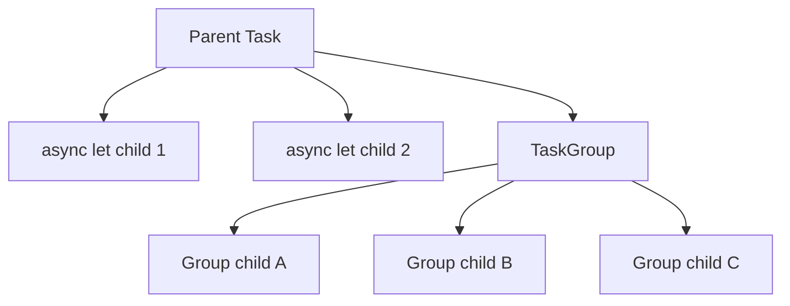

# 02 — Async/Await, Tasks, and Structured Concurrency

Modern Swift concurrency gives you language-level tools for expressing asynchronous work more safely and clearly.
Instead of manually coordinating callbacks, queues, and completion bookkeeping, you model asynchronous control flow directly.
This file focuses on tasks, task hierarchy, cancellation, and bridging old APIs.

## Learning goals

By the end of this file you should be able to:

- Explain what `async` and `await` mean.
- Describe suspension points precisely.
- Explain task lifecycle and task hierarchy.
- Compare structured and unstructured tasks.
- Use `async let` and `TaskGroup` appropriately.
- Explain cancellation and priorities.
- Use cancellation handlers.
- Bridge callback APIs with continuations.
- Discuss unsafe continuations carefully.

## Async/await fundamentals

An `async` function is a function that may suspend.
Suspension means it can pause at an `await` point and allow the underlying thread to do other work.
That is different from blocking.
Blocking ties up the thread.
Suspension frees the thread to run something else.

```swift
import Foundation

struct User: Decodable {
    let id: Int
    let name: String
}

final class UserAPI {
    func fetchUser(id: Int) async throws -> User {
        let url = URL(string: "https://example.com/users/\(id)")!
        let (data, _) = try await URLSession.shared.data(from: url)
        return try JSONDecoder().decode(User.self, from: data)
    }
}
```

The function above is `async` because network I/O is asynchronous.
At `await`, execution may suspend.
When data arrives, the task resumes.

> 💡 **Tip:** In interviews, say “`await` marks a potential suspension point” rather than “`await` runs this on another thread.” The latter is not the core guarantee.

## What a task is

A `Task` is the runtime-managed unit of asynchronous work in Swift concurrency.
Tasks carry metadata such as priority and cancellation state.
They also participate in structured parent-child relationships when created in structured contexts.

### Task lifecycle at a high level

- A task is created.
- It begins running.
- It may suspend at `await` points.
- It may resume multiple times.
- It eventually completes with a value, throws, or is cancelled.

### Tasks are not threads

Tasks may move across threads.
A task can suspend on one thread and resume on another.
This is one reason Swift emphasizes isolation and Sendable correctness.

## A simple `Task` example

```swift
import Foundation

final class ProfileViewModel {
    private let api = UserAPI()
    @MainActor private(set) var username: String = ""

    func refresh() {
        Task {
            do {
                let user = try await api.fetchUser(id: 42)
                await MainActor.run {
                    self.username = user.name
                }
            } catch {
                print("Failed to refresh: \(error)")
            }
        }
    }
}
```

This starts asynchronous work from a synchronous context.
That pattern is common in UIKit event handlers.
But it is also a form of unstructured concurrency, so ownership and cancellation need thought.

## Structured concurrency

Structured concurrency means child tasks are scoped to the lifetime of the parent task.
This gives you predictable cleanup, error propagation, and cancellation behavior.
The structure itself becomes part of correctness.

## Mermaid diagram — structured concurrency hierarchy



## Why structured concurrency matters

With callbacks or detached work, it is easy to lose track of who owns ongoing work.
Structured concurrency answers that question.
Child work belongs to the parent scope.
If the parent fails or is cancelled, the child work can be cancelled too.
That makes reasoning easier.

> 🎯 **Interview Answer:** “Structured concurrency gives async work lexical ownership. The parent scope owns the child tasks, which improves cancellation, error propagation, and readability.”

## `Task {}` versus structured child work

A plain `Task {}` created from arbitrary code is unstructured.
It creates a task, but not necessarily as a structured child tied to the surrounding lexical async scope.
Inside an async function, `async let` and task groups are the clearer structured tools.

### `Task {}`

Good for:

- Launching work from synchronous entry points.
- Bridging UIKit events into async code.
- Starting fire-and-observe work when you intentionally manage the handle.

Risks:

- Lost cancellation.
- Harder ownership reasoning.
- Easy to spawn work with no lifecycle management.

## `Task.detached`

`Task.detached` creates a detached task.
It does not inherit actor context the same way as structured child tasks.
It should be used carefully.

Good uses:

- Truly independent background work.
- Work that should not inherit the current actor isolation.
- Advanced cases where you intentionally break structure.

Risks:

- Lost task-local context.
- Lost parent-child cancellation behavior.
- Easy to read or mutate the wrong state from outside expected isolation.

```swift
import Foundation

func warmLargeCache() {
    Task.detached(priority: .background) {
        let entries = try await RemoteCacheAPI().fetchWarmupEntries()
        await CacheStore.shared.preload(entries)
    }
}
```

Even here, you should ask whether a managed application service would own this work more explicitly.
Detached should feel deliberate, not casual.

> ⚠️ **Pitfall:** If you cannot clearly explain who owns a detached task, why it should outlive the current scope, and how cancellation is handled, you probably should not use `Task.detached`.

## `async let`

`async let` creates child tasks whose results are awaited later.
It is great when you have a small fixed number of independent async operations.

```swift
import Foundation

struct ProductScreenData {
    let product: Product
    let reviews: [Review]
    let inventory: Inventory
}

final class ProductScreenService {
    private let api: ProductAPI

    init(api: ProductAPI) {
        self.api = api
    }

    func load(productID: String) async throws -> ProductScreenData {
        async let product = api.fetchProduct(id: productID)
        async let reviews = api.fetchReviews(productID: productID)
        async let inventory = api.fetchInventory(productID: productID)

        return try await ProductScreenData(
            product: product,
            reviews: reviews,
            inventory: inventory
        )
    }
}
```

This is cleaner than manually coordinating a group.
It also makes the fixed fan-out obvious.

### When to use `async let`

- Small fixed number of concurrent child operations.
- Each child returns one value.
- The parent awaits them before scope exit.

### When not to use `async let`

- Dynamic number of child tasks.
- Work that needs incremental result handling.
- Complex cancellation or error aggregation logic.

## TaskGroup

A task group handles a dynamic set of child tasks.
It is the structured concurrency answer to many old `DispatchGroup` use cases.

```swift
import Foundation

struct SearchResult: Sendable {
    let title: String
}

final class SearchAggregator {
    private let providers: [SearchProvider]

    init(providers: [SearchProvider]) {
        self.providers = providers
    }

    func search(query: String) async -> [SearchResult] {
        await withTaskGroup(of: [SearchResult].self) { group in
            for provider in providers {
                group.addTask {
                    await provider.search(query: query)
                }
            }

            var combined: [SearchResult] = []
            for await partial in group {
                combined.append(contentsOf: partial)
            }
            return combined
        }
    }
}
```

### Why task groups are better than many manual GCD patterns

- Child lifetimes are scoped.
- Results can be consumed incrementally.
- Cancellation and failure are easier to express.
- There is less manual shared-state bookkeeping.

### Throwing task groups

If child tasks can throw, use `withThrowingTaskGroup`.
This allows failure propagation in a more natural way.

```swift
import Foundation

final class ThumbnailPipeline {
    private let decoder: ImageDecoder

    init(decoder: ImageDecoder) {
        self.decoder = decoder
    }

    func decodeAll(_ payloads: [Data]) async throws -> [Thumbnail] {
        try await withThrowingTaskGroup(of: Thumbnail.self) { group in
            for data in payloads {
                group.addTask {
                    try await self.decoder.decodeThumbnail(from: data)
                }
            }

            var thumbnails: [Thumbnail] = []
            for try await thumbnail in group {
                thumbnails.append(thumbnail)
            }
            return thumbnails
        }
    }
}
```

## Task cancellation

Swift task cancellation is cooperative.
When a task is cancelled, it becomes marked as cancelled.
Your code must observe that and stop when appropriate.
Some framework APIs also observe cancellation automatically.

### Checking cancellation explicitly

```swift
import Foundation

func buildIndex(documents: [Document]) async throws -> SearchIndex {
    var entries: [IndexEntry] = []

    for document in documents {
        try Task.checkCancellation()
        let entry = try await document.toIndexEntry()
        entries.append(entry)
    }

    return SearchIndex(entries: entries)
}
```

### Using `Task.isCancelled`

```swift
import Foundation

func exportPhotos(_ photos: [Photo]) async {
    for photo in photos {
        if Task.isCancelled {
            break
        }
        await photo.export()
    }
}
```

### Cancellation in UI code

In apps, cancellation matters when screens disappear, searches change, or user intent shifts.
If a new search query arrives, old work should often be cancelled.
If a view controller is going away, refresh work may no longer matter.

> 💡 **Tip:** A senior answer often mentions cancellation at the feature boundary, not just inside utility functions.

## Task priorities

Tasks can have priorities such as `.high`, `.medium`, `.low`, `.background`, or `.userInitiated` depending on the API surface involved.
Priority is a scheduling hint.
It is not a strict guarantee.

```swift
Task(priority: .userInitiated) {
    try await refreshCriticalContent()
}
```

You should think of task priority similarly to QoS.
Choose it based on user impact.
Do not rely on it for correctness.

## `withTaskCancellationHandler`

This API lets you register cleanup logic that runs when the task is cancelled.
It is useful for releasing resources or forwarding cancellation to underlying systems.

```swift
import Foundation

func streamFile(from handle: FileHandle) async throws -> Data {
    try await withTaskCancellationHandler {
        var data = Data()
        for try await chunk in handle.bytes {
            try Task.checkCancellation()
            data.append(contentsOf: chunk)
        }
        return data
    } onCancel: {
        try? handle.close()
    }
}
```

### When this matters

- You need explicit cleanup.
- You bridge to lower-level APIs that need a cancel signal.
- You want cancellation to do more than just stop future work.

## Bridging callback APIs with continuations

Many existing iOS APIs and third-party SDKs use completion handlers.
Continuations let you wrap those in async functions.

### `withCheckedContinuation`

Use for non-throwing completion-based APIs.
The checked variant helps detect misuse such as resuming more than once.

```swift
import Foundation

final class LegacyProfileService {
    func fetchProfile(id: String, completion: @escaping (Profile) -> Void) {
        completion(Profile(id: id, name: "Taylor"))
    }
}

extension LegacyProfileService {
    func fetchProfile(id: String) async -> Profile {
        await withCheckedContinuation { continuation in
            fetchProfile(id: id) { profile in
                continuation.resume(returning: profile)
            }
        }
    }
}
```

### `withCheckedThrowingContinuation`

Use when the completion handler can fail.

```swift
import Foundation

enum UploadError: Error {
    case serverRejected
}

final class LegacyUploader {
    func upload(data: Data, completion: @escaping (Result<URL, Error>) -> Void) {
        completion(.success(URL(string: "https://example.com/file")!))
    }
}

extension LegacyUploader {
    func upload(data: Data) async throws -> URL {
        try await withCheckedThrowingContinuation { continuation in
            upload(data: data) { result in
                continuation.resume(with: result)
            }
        }
    }
}
```

### Rules for safe continuation usage

- Resume exactly once.
- Make sure every path resumes.
- Do not forget cancellation behavior if the underlying API supports it.
- Avoid storing continuations unless absolutely necessary and well-controlled.

> ⚠️ **Pitfall:** Forgetting to resume a continuation causes the awaiting task to hang forever. Resuming twice is a correctness bug that checked continuations help catch.

## `withUnsafeContinuation` and `withUnsafeThrowingContinuation`

Unsafe continuations remove runtime checking overhead.
They are only appropriate when you are absolutely sure the bridging code is correct.
In most interview and production cases, prefer the checked variants.

Use unsafe variants when:

- You are optimizing a hot path with verified correctness.
- You are wrapping performance-sensitive code and understand the risks.
- You already proved the continuation discipline is exact.

In interviews, saying “I default to checked and only use unsafe when measurement and strict guarantees justify it” is the senior answer.

## A more production-quality wrapper with cancellation forwarding

```swift
import Foundation

final class LegacySearchService {
    @discardableResult
    func search(
        query: String,
        completion: @escaping (Result<[String], Error>) -> Void
    ) -> CancellableRequest {
        let request = CancellableRequest()
        completion(.success(["A", "B", "C"]))
        return request
    }
}

final class CancellableRequest {
    private let lock = NSLock()
    private var cancelled = false

    func cancel() {
        lock.lock()
        cancelled = true
        lock.unlock()
    }

    var isCancelled: Bool {
        lock.lock()
        defer { lock.unlock() }
        return cancelled
    }
}

extension LegacySearchService {
    func search(query: String) async throws -> [String] {
        var request: CancellableRequest?

        return try await withTaskCancellationHandler {
            try await withCheckedThrowingContinuation { continuation in
                request = search(query: query) { result in
                    continuation.resume(with: result)
                }
            }
        } onCancel: {
            request?.cancel()
        }
    }
}
```

This example demonstrates a real migration concern.
Wrapping the completion alone is not enough if the legacy layer also supports cancellation.
Good wrappers preserve that behavior.

## Choosing between `async let` and `TaskGroup`

Use `async let` when the child count is small and fixed.
Use `TaskGroup` when the child count is dynamic or when you want incremental result consumption.

A useful interview phrase:

- `async let` is concise fixed-shape parallelism.
- `TaskGroup` is dynamic structured fan-out/fan-in.

## Common mistakes with tasks

- Spawning `Task {}` everywhere from view code with no cancellation plan.
- Using detached tasks when structured child work would do.
- Forgetting that cancellation is cooperative.
- Updating UI from non-main-isolated contexts.
- Bridging callbacks without forwarding errors or cancellation.
- Forgetting that `await` introduces reentrancy opportunities in isolated contexts.

## Practical UIKit example — cancelling search as the query changes

```swift
import Foundation
import UIKit

@MainActor
final class SearchViewModel {
    private let service: SearchService
    private(set) var results: [SearchResult] = []
    private var searchTask: Task<Void, Never>?

    init(service: SearchService) {
        self.service = service
    }

    func updateQuery(_ query: String) {
        searchTask?.cancel()

        guard !query.isEmpty else {
            results = []
            return
        }

        searchTask = Task {
            do {
                let fetched = try await service.search(query: query)
                try Task.checkCancellation()
                results = fetched
            } catch is CancellationError {
                // Ignore expected cancellation.
            } catch {
                results = []
            }
        }
    }
}
```

This is a practical, interview-friendly example.
It shows ownership of the in-flight task.
It shows cancellation on new input.
It keeps UI updates on the main actor.

## Senior-level discussion

Modern Swift concurrency is not just “nicer syntax for callbacks.”
It changes how you design APIs and ownership.
The strongest teams use `async` signatures to make asynchrony visible and use structured concurrency to make lifetime explicit.

A senior engineer should recognize several design principles:

- Preserve structure whenever possible.
- Keep unstructured tasks at edges.
- Model cancellation intentionally.
- Bridge old APIs carefully, not mechanically.
- Prefer clear ownership over incidental parallelism.
- Use concurrency to improve responsiveness and throughput, not to impress code reviewers.

A mature codebase often mixes models.
UIKit event handlers may launch `Task {}`.
Service layers may expose async APIs.
Under the hood, some wrappers still use delegates, queues, or operations.
The key is clarity of boundaries.

## Interview Q&A

### 1. What does `async` mean in Swift?

It means the function can suspend.
Callers must use `await` at suspension points.
The core idea is asynchronous control flow, not automatic background threading.

### 2. What does `await` mean?

It marks a potential suspension point.
The current task may pause and later resume when the awaited operation produces a result.

### 3. How is suspension different from blocking?

Blocking keeps the thread occupied and unable to do other work.
Suspension frees the underlying thread so the runtime can schedule something else.

### 4. What is a `Task`?

A task is the runtime-managed unit of asynchronous work.
It carries metadata like priority and cancellation state and can participate in structured parent-child relationships.

### 5. What is structured concurrency?

It is a model where child tasks are scoped to the parent’s lifetime.
That makes ownership, cancellation, and error propagation more predictable.

### 6. What is the difference between `Task {}` and `Task.detached {}`?

`Task {}` is unstructured but still often inherits context such as actor isolation from where it is created.
`Task.detached` intentionally breaks away from that context and should be used more sparingly.

### 7. When would you use `async let`?

When you have a small fixed number of independent async operations whose results you want to await later in the same scope.

### 8. When would you use `TaskGroup`?

When the number of child tasks is dynamic or when you want to consume child results incrementally as they complete.

### 9. How does cancellation work in Swift concurrency?

Cancellation is cooperative.
A task becomes marked as cancelled, and your code or framework APIs must observe that and stop work appropriately.

### 10. Why use `withTaskCancellationHandler`?

It lets you run cleanup or forward cancellation to underlying systems when a task is cancelled.
That is especially useful for bridged legacy APIs.

### 11. What problem do checked continuations solve?

They let you wrap callback APIs as async functions while providing runtime checks for common misuse like resuming the continuation more than once.

### 12. When would you use `withUnsafeContinuation`?

Only when you have a proven reason to avoid checked overhead and you are confident the bridging logic is correct.
Checked is the default choice.

### 13. What is a common mistake when migrating completion handlers to async/await?

Wrapping the callback mechanically but forgetting cancellation, error mapping, or queue/actor expectations.
A good migration preserves semantics, not just shape.

### 14. Is `async/await` always parallel?

No.
It is about asynchronous control flow.
Parallelism only happens when you introduce multiple child tasks or independent work that can overlap.

### 15. What is the senior-level summary of modern Swift concurrency?

Use async functions to make suspension explicit, structured child tasks to make ownership explicit, and careful bridging to preserve correctness while incrementally modernizing older code.
