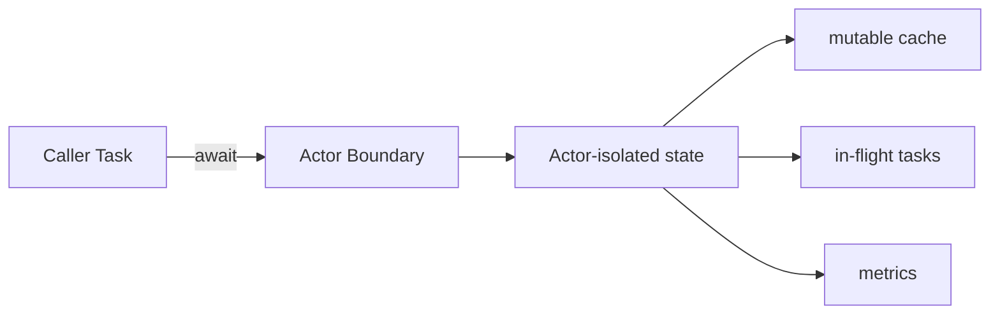

# 03 — Actors, Isolation, MainActor, and Sendable

Actors are one of the central tools in modern Swift concurrency.
They give you a language-level way to protect mutable state by isolation rather than ad hoc queue discipline.
That does not mean they are magic.
You still need to understand actor boundaries, reentrancy, Sendable rules, and when `@MainActor` does or does not apply.

## Learning goals

By the end of this file you should be able to:

- Explain the actor model in Swift terms.
- Describe actor isolation clearly.
- Use `@MainActor` on types and functions appropriately.
- Explain actor reentrancy and the bugs it can create.
- Define `Sendable` and `@Sendable` accurately.
- Explain sending values across actor boundaries.
- Describe global actors.
- Explain `nonisolated`.

## Why actors exist

Shared mutable state is a major source of concurrency bugs.
Traditional solutions include locks, serial queues, and careful convention.
Actors make state protection part of the type system and call model.
They give you a clear boundary: actor-isolated mutable state should only be touched through the actor.

## The actor model at a practical level

An actor is a reference type with protected mutable state.
Only one actor-isolated execution context can access that state at a time.
Calls from outside the actor boundary are asynchronous.
That is why cross-actor calls often require `await`.

```swift
import Foundation

actor Counter {
    private var value = 0

    func increment() {
        value += 1
    }

    func currentValue() -> Int {
        value
    }
}
```

Using it:

```swift
import Foundation

let counter = Counter()

Task {
    await counter.increment()
    let value = await counter.currentValue()
    print(value)
}
```

From outside the actor, those method calls cross an isolation boundary.
That is why `await` is required.

> 🎯 **Interview Answer:** “An actor is a reference type that serializes access to its isolated mutable state. It helps prevent data races by making cross-boundary access explicit and asynchronous.”

## Actor isolation

Actor isolation means the actor owns access to its internal mutable state.
Code running outside the actor cannot directly read or write actor-isolated properties.
It must go through actor methods or explicitly exposed safe interfaces.

### What is actor-isolated

Typically:

- Stored mutable properties inside the actor.
- Methods that access those properties.
- Subscripts or computed properties that read/write isolated state.

### What is not automatically actor-isolated

- Static members.
- `nonisolated` members.
- Data outside the actor boundary.

## Mermaid diagram — actor isolation boundary



## A production-style actor example

```swift
import Foundation

actor ImageLoaderRegistry {
    private var inFlight: [URL: Task<Data, Error>] = [:]
    private let session: URLSession

    init(session: URLSession = .shared) {
        self.session = session
    }

    func data(for url: URL) async throws -> Data {
        if let existing = inFlight[url] {
            return try await existing.value
        }

        let task = Task<Data, Error> {
            let (data, _) = try await session.data(from: url)
            return data
        }

        inFlight[url] = task

        defer {
            inFlight[url] = nil
        }

        return try await task.value
    }
}
```

This actor deduplicates in-flight network requests.
Only one task per URL is allowed at a time.
That is a realistic use case where actor ownership is clearer than scattered queue access.

## `@MainActor`

`@MainActor` is a global actor that represents main-actor isolation.
It is commonly used for UI-facing state and APIs.
In UIKit and SwiftUI code, it helps make main-thread-affecting work explicit.

### Function-level `@MainActor`

Use it when a specific function must run in main-actor context.

```swift
import UIKit

final class ProfileViewController: UIViewController {
    private let viewModel = ProfileViewModel()

    @MainActor
    func apply(viewState: ProfileViewState) {
        title = viewState.title
        view.backgroundColor = viewState.backgroundColor
    }
}
```

### Type-level `@MainActor`

Use it when the whole type should be main-actor isolated.
This is common for UI view models or controller-like types whose mutable state is UI-facing.

```swift
import Foundation

@MainActor
final class FeedViewModel {
    private let service: FeedService
    private(set) var items: [FeedItem] = []
    private(set) var isLoading = false

    init(service: FeedService) {
        self.service = service
    }

    func refresh() async {
        isLoading = true
        defer { isLoading = false }

        do {
            items = try await service.fetchFeed()
        } catch {
            items = []
        }
    }
}
```

### Function-level versus type-level annotation

Function-level annotation is narrower.
It is useful when only a few entry points must be main-actor isolated.
Type-level annotation is broader and reduces annotation noise when most members are UI-bound.

A strong interview answer includes this tradeoff:

- Use type-level when the type’s mutable state is inherently UI-facing.
- Use function-level when only certain APIs need main-actor access.

> 💡 **Tip:** `@MainActor` is about isolation semantics. In common app code that usually lines up with main-thread execution, but the most precise phrasing is “main-actor isolated.”

## `MainActor.run`

Sometimes you are in a non-main-isolated async context and need to hop to the main actor for a small region.
`MainActor.run` is appropriate there.

```swift
import Foundation

func refreshAndUpdateUI(service: FeedService, label: UILabel) {
    Task {
        do {
            let items = try await service.fetchFeed()
            await MainActor.run {
                label.text = "Loaded \(items.count) items"
            }
        } catch {
            await MainActor.run {
                label.text = "Load failed"
            }
        }
    }
}
```

## Actor reentrancy

Actor reentrancy is the idea that when an actor-isolated function hits an `await`, the actor can process other work before the original function resumes.
This improves throughput.
It also creates subtle logic hazards.

### Why reentrancy exists

If actors blocked completely at every async wait, throughput would be terrible.
Allowing other messages to make progress keeps the system responsive.
But your isolated state may change between suspension and resumption.

### Reentrancy example

```swift
import Foundation

actor BankAccount {
    private var balance: Decimal

    init(balance: Decimal) {
        self.balance = balance
    }

    func transfer(amount: Decimal, to recipient: BankService) async throws {
        guard balance >= amount else {
            throw TransferError.insufficientFunds
        }

        balance -= amount

        do {
            try await recipient.send(amount: amount)
        } catch {
            balance += amount
            throw error
        }
    }

    func currentBalance() -> Decimal {
        balance
    }
}
```

This code may look safe.
But if the actor suspends during `await recipient.send(...)`, other calls can run on the actor before resumption.
That may or may not be acceptable depending on your invariants.

### A more obviously risky example

```swift
import Foundation

actor AuthTokenStore {
    private var token: String?
    private var refreshInProgress = false
    private let api: AuthAPI

    init(api: AuthAPI) {
        self.api = api
    }

    func validToken() async throws -> String {
        if let token {
            return token
        }

        if refreshInProgress {
            try await Task.sleep(nanoseconds: 100_000_000)
            return try await validToken()
        }

        refreshInProgress = true
        defer { refreshInProgress = false }

        let newToken = try await api.refreshToken()
        token = newToken
        return newToken
    }
}
```

This can devolve into awkward reentrant behavior and polling.
A better design might store a shared in-flight task rather than a boolean flag.
That is a great senior interview talking point.

### Reentrancy-safe redesign

```swift
import Foundation

actor BetterAuthTokenStore {
    private var token: String?
    private var refreshTask: Task<String, Error>?
    private let api: AuthAPI

    init(api: AuthAPI) {
        self.api = api
    }

    func validToken() async throws -> String {
        if let token {
            return token
        }

        if let refreshTask {
            return try await refreshTask.value
        }

        let task = Task<String, Error> {
            try await api.refreshToken()
        }

        refreshTask = task
        defer { refreshTask = nil }

        let newToken = try await task.value
        token = newToken
        return newToken
    }
}
```

This design makes the reentrant state clearer.
Instead of a boolean, the actor owns the shared in-flight refresh.
That is more robust.

> ⚠️ **Pitfall:** Actor isolation prevents many data races, but it does not prevent logical races caused by reentrancy across suspension points.

## Sendable

`Sendable` is a protocol that marks values as safe to transfer across concurrency domains.
The compiler uses it to help prevent unsafe sharing.
In practical terms, it matters when data crosses actor boundaries or is captured by concurrent closures.

### Why Sendable matters

Tasks and actors may resume on different threads.
Without rules around what data is safe to move or capture, subtle races become easy.
Sendable helps formalize the idea that a value can cross concurrency boundaries safely.

### Typical Sendable types

- Value types composed of Sendable stored properties.
- Immutable structs.
- Enums carrying Sendable associated values.
- Actors themselves are safe references to pass around because their state is isolated.

### A Sendable model

```swift
import Foundation

struct SearchRequest: Sendable {
    let query: String
    let page: Int
}
```

### A type that may not be Sendable by default

Reference types with mutable shared state are the classic problem.
If you pass a mutable class instance into concurrent work, you may be sharing unsafe mutable state.

```swift
import Foundation

final class MutableSessionState {
    var retryCount = 0
}
```

This class is not automatically safe to share across concurrent tasks.
You would typically redesign the ownership model rather than force conformance.

## `@Sendable` closures

A closure marked `@Sendable` must capture only values that are safe to transfer or otherwise allowed by the compiler’s concurrency rules.
This matters for task bodies and APIs that may execute concurrently.

```swift
import Foundation

func performConcurrently(_ work: @Sendable @escaping () -> Void) {
    DispatchQueue.global().async(execute: work)
}
```

If a closure captures mutable non-Sendable state, the compiler can warn or error under stricter checking.
That is a feature, not an inconvenience.
It is guiding you away from unsafe sharing.

## Sending across actor boundaries

When you call an actor from outside, arguments and results conceptually cross an isolation boundary.
That is one reason Sendable correctness matters.
If you pass data into an actor, that data should be safe to transfer.
If you return data from an actor, it should also be safe for the receiving context.

### Example

```swift
import Foundation

struct EventPayload: Sendable {
    let name: String
    let timestamp: Date
}

actor AnalyticsBuffer {
    private var events: [EventPayload] = []

    func record(_ payload: EventPayload) {
        events.append(payload)
    }

    func flush() -> [EventPayload] {
        let snapshot = events
        events.removeAll()
        return snapshot
    }
}
```

`EventPayload` is a good actor-boundary value.
It is a small immutable struct with Sendable-friendly fields.
That is the kind of shape you want.

## Global actors

A global actor defines a globally shared isolation domain.
`MainActor` is the most common example.
You can also define custom global actors for app-wide subsystems.

```swift
import Foundation

@globalActor
actor DatabaseActor {
    static let shared = DatabaseActor()
}

@DatabaseActor
final class DatabaseWriter {
    func save(_ event: EventPayload) {
        // Serialized database writes.
    }
}
```

### When global actors help

- You need a single shared isolation domain for a subsystem.
- You want APIs to declare that domain explicitly.
- The subsystem has a natural singleton-like execution boundary.

### When to be careful

- Overusing global actors can create broad serialization bottlenecks.
- They can become “everything goes through here” designs.
- Sometimes a smaller actor instance boundary is more scalable.

## `nonisolated`

`nonisolated` lets an actor member be accessed without hopping onto the actor.
It is appropriate only when the member does not depend on actor-isolated mutable state.
Typical examples include constants, protocol requirement conformances, or derived metadata that does not touch isolated state.

```swift
import Foundation

actor BuildInfoStore {
    let version: String

    init(version: String) {
        self.version = version
    }

    nonisolated func moduleName() -> String {
        "Concurrency"
    }
}
```

Be careful here.
If the method needs isolated mutable state, `nonisolated` is wrong.
Do not use it as an escape hatch around the actor model.

## Protocol conformance and actors

Sometimes protocol requirements are synchronous while actor methods are isolated and thus async from outside.
This can create design friction.
You may need:

- A `nonisolated` member.
- A redesign of the protocol.
- An adapter type.
- A global-actor-isolated protocol requirement.

This is worth mentioning in senior interviews because it shows you understand actor adoption has API design consequences.

## Choosing actor boundaries well

Good actor boundaries usually align with ownership of mutable state.
Examples:

- A cache registry actor.
- A deduplicating token refresh actor.
- A background persistence actor.
- A download coordinator actor.

Bad actor choices often look like this:

- One giant app-wide actor that serializes too much.
- Actors used only as wrappers around otherwise stateless services.
- Actor boundaries that constantly shuttle large mutable reference graphs back and forth.

## UIKit and actors

UIKit itself is heavily main-thread oriented.
That means many UI-facing types are naturally `@MainActor` rather than custom actors.
Custom actors are often more useful in services, caches, coordinators, and data pipelines behind the UI.

A strong interview answer might say:

- Use `@MainActor` for UI state and controller/view-model coordination.
- Use custom actors for background shared mutable state.
- Keep boundaries explicit between the two.

## Common pitfalls

- Assuming actors remove all race conditions.
- Ignoring reentrancy across `await` points.
- Marking things `nonisolated` too aggressively.
- Forcing `@unchecked Sendable` where redesign is better.
- Using a global actor as a dumping ground.
- Treating `@MainActor` as a performance excuse to keep too much work on the main actor.

> ⚠️ **Pitfall:** `@MainActor` is not permission to do expensive work in UI types. Heavy CPU work should still move off the main actor and return results back safely.

## Senior-level discussion

Actors are a powerful design tool because they make ownership visible.
But they are not free.
Every actor boundary is an async boundary.
Every `await` is a reentrancy point.
Every Sendable rule is feedback about data ownership.

Senior engineers use actors where mutable state truly needs protection.
They avoid actor proliferation for stateless helpers.
They understand that some subsystems are better expressed as main-actor-bound view models, some as custom actors, and some as plain value-oriented async services.

A few decision heuristics:

- If the problem is shared mutable state, an actor is a strong candidate.
- If the problem is UI mutation, `@MainActor` is usually the right starting point.
- If the type is stateless, do not create an actor just because concurrency exists nearby.
- If performance depends on throughput, watch for actor bottlenecks and reentrancy complexity.
- If you need to share data across boundaries, design small Sendable values rather than shipping mutable reference types around.

## Interview Q&A

### 1. What is an actor in Swift?

An actor is a reference type that protects its mutable state through isolation.
Outside code must cross an async boundary to access actor-isolated members.

### 2. What problem do actors solve?

They help prevent data races around shared mutable state by making access serialization and isolation part of the model.

### 3. Why do cross-actor calls require `await`?

Because they cross an isolation boundary and may need to suspend until the actor can process that work.

### 4. What is actor isolation?

Actor isolation means the actor owns access to its isolated mutable state.
Code outside the actor cannot directly touch that state safely.

### 5. What is `@MainActor`?

It is a global actor representing main-actor isolation.
It is commonly used for UI-facing state and APIs.

### 6. When would you annotate a whole type with `@MainActor`?

When most or all of its mutable state and methods are inherently UI-bound, such as a UIKit-facing view model.

### 7. When would you annotate only a function with `@MainActor`?

When only specific entry points need main-actor isolation and the rest of the type is not fundamentally UI-bound.

### 8. What is actor reentrancy?

When an actor-isolated function suspends at an `await`, the actor may process other work before the original function resumes.
That can change state and affect logic.

### 9. Why is reentrancy tricky?

Because your assumptions before `await` may no longer hold after resumption.
You must design invariants around that possibility.

### 10. What is `Sendable`?

A protocol used by Swift’s concurrency system to model values that are safe to transfer across concurrency domains.

### 11. What is an `@Sendable` closure?

A closure whose captures must satisfy concurrency safety rules for transfer or concurrent execution.
It helps prevent unsafe captured mutable state.

### 12. What is a global actor?

A shared actor-based isolation domain applied across declarations.
`MainActor` is the most common example.

### 13. What does `nonisolated` mean?

It marks a member so it can be accessed without hopping onto the actor, but only when that member does not rely on actor-isolated mutable state.

### 14. Are actors always better than queues?

No.
Actors are better when isolated mutable state is the central problem and you want language-level safety.
Queues may still fit legacy code, explicit scheduling needs, or narrower interop boundaries.

### 15. What is the senior takeaway on actors?

Use them to model ownership of shared mutable state, respect reentrancy, design Sendable boundaries carefully, and avoid treating them as universal replacements for every concurrency primitive.
