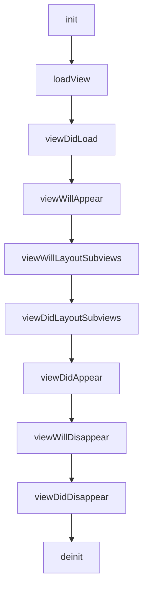

# 01 — View and View Controller Lifecycle

UIKit is built on hierarchy and timing.
If you do not know when a view exists, when it is visible, and when layout callbacks fire, many bugs feel random.
In reality, they are usually lifecycle bugs.
This file covers the UIView hierarchy and the UIViewController lifecycle in a practical interview-ready way.

## Learning goals

By the end of this file you should be able to:

- Explain the UIView hierarchy.
- Describe the purpose of UIViewController.
- Walk through lifecycle callbacks in order.
- Explain where to put setup work.
- Explain layout-related lifecycle callbacks.
- Discuss common pitfalls like early view access and forgetting `super`.
- Use lifecycle knowledge to reason about bugs.

## UIView hierarchy mental model

A UIKit screen is a tree of views.
Each view can contain subviews.
Geometry, drawing, clipping, event handling, and layout all flow through this tree.
A view controller usually owns the root of a screen’s view hierarchy.

### Important hierarchy concepts

- A view has a `frame` in its superview’s coordinate system.
- A view has `bounds` in its own coordinate system.
- A superview positions and clips subviews.
- Visibility and event handling are affected by the hierarchy.
- Constraint relationships are often expressed between related views in the same tree.

### Why hierarchy matters in interviews

Many UIKit bugs are really hierarchy bugs:

- Adding constraints before two views share a common ancestor.
- Adding subviews to the wrong container.
- Assuming a view exists before it is loaded.
- Misunderstanding which controller owns which view tree.

## UIViewController’s role

A view controller manages a view hierarchy and participates in lifecycle transitions.
It is not supposed to be a dumping ground for every piece of app logic.
It should coordinate UI state, child containment, navigation interactions, and view lifecycle events.

> 🎯 **Interview Answer:** “A view controller owns screen lifecycle and coordination. It should manage the view hierarchy and screen-level behavior, while heavier business logic and navigation policy usually live in dedicated collaborators.”

### Typical responsibilities

- Load and own the root view.
- Configure and update visible UI.
- Respond to lifecycle callbacks.
- Coordinate child view controllers when needed.
- Start and stop screen-scoped work.
- Forward user intent to view models, services, or coordinators.

## Lifecycle overview

A controller does not start with its view loaded.
The view is usually created lazily when needed.
Then the controller receives lifecycle callbacks as the screen is prepared, appears, lays out, disappears, and is eventually deallocated.

## Mermaid diagram — UIViewController lifecycle



## `loadView`

`loadView` is where the controller creates its root view if you are not using storyboards or nibs for that root.
If you override it, you are responsible for assigning `view`.

### When to override `loadView`

- Programmatic UI where the controller owns a custom root view.
- Replacing the default empty root view with a strongly typed custom view.
- Avoiding the need for a separate nib or storyboard for the root screen.

### Example

```swift
import UIKit

final class ProfileView: UIView {
    let nameLabel = UILabel()
    let avatarView = UIImageView()

    override init(frame: CGRect) {
        super.init(frame: frame)
        backgroundColor = .systemBackground
        nameLabel.font = .preferredFont(forTextStyle: .title2)
        avatarView.contentMode = .scaleAspectFill
        avatarView.clipsToBounds = true

        addSubview(avatarView)
        addSubview(nameLabel)

        avatarView.translatesAutoresizingMaskIntoConstraints = false
        nameLabel.translatesAutoresizingMaskIntoConstraints = false

        NSLayoutConstraint.activate([
            avatarView.topAnchor.constraint(equalTo: safeAreaLayoutGuide.topAnchor, constant: 24),
            avatarView.centerXAnchor.constraint(equalTo: centerXAnchor),
            avatarView.widthAnchor.constraint(equalToConstant: 96),
            avatarView.heightAnchor.constraint(equalTo: avatarView.widthAnchor),

            nameLabel.topAnchor.constraint(equalTo: avatarView.bottomAnchor, constant: 16),
            nameLabel.centerXAnchor.constraint(equalTo: centerXAnchor)
        ])
    }

    @available(*, unavailable)
    required init?(coder: NSCoder) {
        fatalError("init(coder:) has not been implemented")
    }
}

final class ProfileViewController: UIViewController {
    private let rootView = ProfileView()

    override func loadView() {
        view = rootView
    }
}
```

### Key rule

If you override `loadView`, do not call `super.loadView()` unless you intentionally want the default loading behavior.
Most programmatic overrides simply assign `view`.

> ⚠️ **Pitfall:** Accessing `view` inside `init` or before the controller is ready can trigger view loading too early and blur lifecycle boundaries.

## `viewDidLoad`

`viewDidLoad` is called after the view hierarchy has been loaded into memory.
For most screens, this is the one-time setup point.

### Good work for `viewDidLoad`

- Configure static UI properties.
- Add subviews if not done in the custom root view.
- Set delegates and data sources.
- Bind to view model outputs.
- Start one-time setup logic.
- Register cells.
- Configure navigation items that do not depend on appearance timing.

### Example

```swift
import UIKit

final class FeedViewController: UIViewController {
    private let tableView = UITableView(frame: .zero, style: .plain)
    private let viewModel: FeedViewModel

    init(viewModel: FeedViewModel) {
        self.viewModel = viewModel
        super.init(nibName: nil, bundle: nil)
    }

    @available(*, unavailable)
    required init?(coder: NSCoder) {
        fatalError("init(coder:) has not been implemented")
    }

    override func loadView() {
        view = UIView()
        view.backgroundColor = .systemBackground
    }

    override func viewDidLoad() {
        super.viewDidLoad()

        title = "Feed"
        tableView.translatesAutoresizingMaskIntoConstraints = false
        tableView.dataSource = self
        tableView.delegate = self
        tableView.register(FeedCell.self, forCellReuseIdentifier: FeedCell.reuseIdentifier)

        view.addSubview(tableView)

        NSLayoutConstraint.activate([
            tableView.topAnchor.constraint(equalTo: view.safeAreaLayoutGuide.topAnchor),
            tableView.leadingAnchor.constraint(equalTo: view.leadingAnchor),
            tableView.trailingAnchor.constraint(equalTo: view.trailingAnchor),
            tableView.bottomAnchor.constraint(equalTo: view.bottomAnchor)
        ])
    }
}
```

### What not to do in `viewDidLoad`

- Start expensive repeated work that belongs to visibility changes.
- Assume final frames are already correct.
- Trigger analytics impressions that should happen only when the screen is truly visible.
- Put appearance-only work here if the screen can disappear and reappear.

## `viewWillAppear`

This is called before the view becomes visible.
It can run multiple times during the controller’s lifetime.
Use it for work that must happen each time the screen is about to appear.

### Good uses

- Refreshing visible data if it may have changed.
- Starting appearance-bound analytics.
- Updating navigation bar visibility or style.
- Restarting UI behavior tied to visibility.

```swift
override func viewWillAppear(_ animated: Bool) {
    super.viewWillAppear(animated)
    navigationController?.setNavigationBarHidden(false, animated: animated)
    viewModel.refreshIfNeeded()
}
```

## `viewDidAppear`

This is called after the view is on screen.
It is a better place for actions that should happen only after presentation actually completed.

### Good uses

- Starting animations that require the final visible state.
- Triggering analytics impression events.
- Presenting guidance UI that should wait until the screen is visible.
- Starting interactions that rely on being fully onscreen.

### Example

```swift
override func viewDidAppear(_ animated: Bool) {
    super.viewDidAppear(animated)

    if viewModel.shouldShowOnboardingHint {
        presentOnboardingHint()
    }
}
```

## `viewWillDisappear`

This is called before the view leaves the screen.
Use it for work that should stop when the screen is about to go away.

### Common uses

- Pausing media playback.
- Ending edit mode.
- Committing draft UI state.
- Cancelling or deferring screen-specific work.

## `viewDidDisappear`

This is called after the view is no longer visible.
It can be useful for cleanup that should only occur once the screen is fully gone.

### Common uses

- Stopping visibility-bound analytics timers.
- Releasing temporary heavy resources.
- Confirming screen-specific tasks should be cancelled.

## Layout callbacks

UIKit also provides layout-specific callbacks.
These are not appearance callbacks.
They relate to geometry changes and subview layout.

### `viewWillLayoutSubviews`

Called before laying out subviews.
Useful for last-minute layout invalidation or updates that need to happen just before frames are computed.
Use sparingly.

### `viewDidLayoutSubviews`

Called after subviews have been laid out.
At this point, frames are generally up to date for that pass.
It is useful for logic that depends on actual sizes.

### Example — adjusting a gradient layer after layout

```swift
import UIKit

final class HeroHeaderViewController: UIViewController {
    private let headerView = UIView()
    private let gradientLayer = CAGradientLayer()

    override func loadView() {
        view = UIView()
        view.backgroundColor = .systemBackground
    }

    override func viewDidLoad() {
        super.viewDidLoad()
        headerView.translatesAutoresizingMaskIntoConstraints = false
        view.addSubview(headerView)
        headerView.layer.addSublayer(gradientLayer)

        NSLayoutConstraint.activate([
            headerView.topAnchor.constraint(equalTo: view.safeAreaLayoutGuide.topAnchor),
            headerView.leadingAnchor.constraint(equalTo: view.leadingAnchor),
            headerView.trailingAnchor.constraint(equalTo: view.trailingAnchor),
            headerView.heightAnchor.constraint(equalToConstant: 220)
        ])
    }

    override func viewDidLayoutSubviews() {
        super.viewDidLayoutSubviews()
        gradientLayer.frame = headerView.bounds
    }
}
```

This is a practical example.
`viewDidLoad` is too early for final bounds.
`viewDidLayoutSubviews` is the right phase for layer frame adjustments that depend on layout results.

## `deinit`

`deinit` runs when the controller is deallocated.
It is important for memory management reasoning and leak debugging.
In interviews, mentioning `deinit` shows you think about lifecycle completion, not just initial setup.

### Common uses

- Verifying observers or tasks were cleaned up.
- Logging during development for leak diagnosis.
- Cancelling long-lived resources if the type truly owns them.

```swift
deinit {
    print("FeedViewController deinitialized")
}
```

If `deinit` never runs when you expect it to, you may have a retain cycle.
That is a good debugging clue.

## Accessing `view` too early

A classic mistake is touching `view` too early, such as during initialization in ways that force loading before dependencies or intended sequencing are ready.

### Why it is risky

- It triggers view loading before you intended.
- It makes lifecycle reasoning harder.
- It can produce partially configured screens.
- It can create subtle bugs if collaborators are not ready yet.

### Better approach

Inject dependencies in `init`.
Create the view in `loadView` or let UIKit load it.
Do configuration in `viewDidLoad` or later phases as appropriate.

## Forgetting `super`

In most lifecycle methods, you should call `super`.
UIKit relies on superclass behavior for correct system operation.
Skipping it can create hard-to-debug issues.

### Methods where `super` is especially important

- `viewDidLoad`
- `viewWillAppear`
- `viewDidAppear`
- `viewWillDisappear`
- `viewDidDisappear`
- `viewWillLayoutSubviews`
- `viewDidLayoutSubviews`

> ⚠️ **Pitfall:** “It seems to work without `super`” is not a good reason to omit it. UIKit hooks and future behavior may rely on the superclass implementation.

## Child view controllers and containment

A parent controller can contain child controllers.
This is how UIKit builds many composite interfaces.
Examples include tab bars, navigation controllers, page containers, and custom dashboard screens.

### Containment steps

- Call `addChild(child)`.
- Add the child’s view to the hierarchy.
- Set up constraints or frames.
- Call `child.didMove(toParent: self)`.

### Removal steps

- Call `child.willMove(toParent: nil)`.
- Remove the child’s view.
- Call `child.removeFromParent()`.

Understanding containment is a senior signal because it shows you do not assume every screen is a single flat controller.

## Lifecycle and async work

Modern UIKit code often launches async tasks.
Lifecycle awareness still matters.
If you start work when the screen appears, you may need to cancel or ignore it when the screen disappears.

```swift
import Foundation
import UIKit

@MainActor
final class ProfileController: UIViewController {
    private let service: ProfileService
    private var refreshTask: Task<Void, Never>?

    init(service: ProfileService) {
        self.service = service
        super.init(nibName: nil, bundle: nil)
    }

    @available(*, unavailable)
    required init?(coder: NSCoder) {
        fatalError("init(coder:) has not been implemented")
    }

    override func viewWillAppear(_ animated: Bool) {
        super.viewWillAppear(animated)
        refreshTask = Task {
            do {
                let profile = try await service.fetchProfile()
                apply(profile)
            } catch {
                showErrorState()
            }
        }
    }

    override func viewDidDisappear(_ animated: Bool) {
        super.viewDidDisappear(animated)
        refreshTask?.cancel()
    }

    private func apply(_ profile: Profile) {
        title = profile.name
    }

    private func showErrorState() {
        title = "Error"
    }
}
```

This is not the only valid pattern, but it illustrates lifecycle ownership of screen-scoped work.

## Common interview bugs and how to reason about them

### “My outlet is nil.”

Check whether the view has loaded.
Check whether you are using the correct nib or storyboard connection.
Check whether you are accessing the outlet too early.

### “My screen doesn’t refresh when coming back to it.”

You may have placed refresh logic in `viewDidLoad` when it belongs in `viewWillAppear`.

### “My animation uses the wrong frame the first time.”

You may be reading frames before layout completed.
Use layout callbacks or call `layoutIfNeeded` appropriately.

### “My controller never deinitializes.”

Look for retain cycles.
Typical suspects include delegates, closures, timers, tasks, or coordinator references.

## Senior-level discussion

Senior UIKit engineers are careful about what happens once versus what happens every time.
They do not dump everything into `viewDidLoad`.
They understand that lifecycle methods communicate intent.
They also use lifecycle to define ownership of work.

A few useful heuristics:

- Create or assign the root view in `loadView`.
- Do one-time structural setup in `viewDidLoad`.
- Do per-appearance refresh or UI updates in `viewWillAppear`.
- Do visible-only actions in `viewDidAppear`.
- Stop or cancel appearance-scoped work in disappearance callbacks.
- Use layout callbacks only when geometry truly matters.

In interviews, the strongest answers often mention both correctness and maintainability.
For example, saying “I keep one-time setup in `viewDidLoad` and repeated refresh logic in `viewWillAppear` so future engineers can reason about screen behavior by phase” sounds much stronger than just listing methods.

## Interview Q&A

### 1. What is the purpose of `UIViewController`?

It manages a view hierarchy, participates in lifecycle transitions, and coordinates screen-level behavior such as setup, appearance updates, containment, and navigation-related interactions.

### 2. What is the difference between `loadView` and `viewDidLoad`?

`loadView` creates or assigns the root view.
`viewDidLoad` runs after the view hierarchy has been loaded and is typically used for one-time setup.

### 3. When should you override `loadView()`?

When building a screen programmatically and you want to provide a custom root view instead of relying on nib or storyboard loading.

### 4. What belongs in `viewDidLoad`?

One-time view setup such as configuring subviews, assigning delegates, registering cells, wiring bindings, and setting up constraints.

### 5. What belongs in `viewWillAppear`?

Work that should happen every time the screen is about to appear, such as refreshing visible state or adjusting navigation bar configuration.

### 6. What belongs in `viewDidAppear`?

Actions that should happen only after the screen is actually visible, such as analytics impressions or starting visible-only animations.

### 7. When are frames reliable for geometry-dependent logic?

Generally after layout has run for that pass, such as in `viewDidLayoutSubviews`, unless you force a layout earlier with `layoutIfNeeded`.

### 8. Why can `viewWillAppear` be called multiple times?

Because the same controller can appear, disappear, and reappear during its lifetime.
Appearance callbacks are not one-time setup hooks.

### 9. Why is accessing `view` too early a problem?

Because it can force view loading prematurely, making lifecycle behavior harder to reason about and potentially leading to partially configured state.

### 10. Why should you call `super` in lifecycle methods?

Because UIKit relies on superclass implementations for internal behavior and lifecycle correctness.
Skipping `super` can cause subtle bugs.

### 11. What is `deinit` useful for in a controller?

It is useful for understanding lifetime completion, verifying cleanup, and diagnosing retain cycles when deallocation does not happen as expected.

### 12. What are layout callbacks for?

They let you respond before and after subview layout, especially when you need to adjust logic or layers based on actual computed geometry.

### 13. How do you add a child view controller correctly?

Call `addChild`, add its view, configure layout, and then call `didMove(toParent:)`.
Removal uses the inverse pattern.

### 14. What is a senior-level way to explain lifecycle?

Lifecycle is the contract that tells you when the view exists, when it is visible, when geometry is valid, and when screen-scoped work should start or stop.
