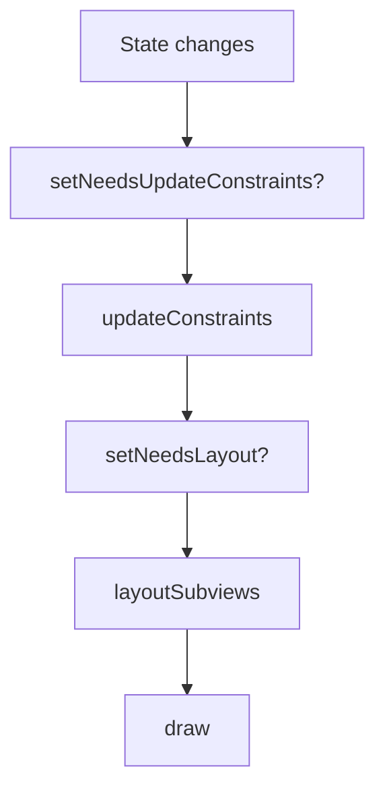

# 02 — Auto Layout and the Layout Cycle

Auto Layout is one of the most common UIKit interview topics because it reveals how well you understand layout timing, ambiguity, priorities, and rendering behavior.
This file covers the practical mental model you need for production work and interview discussion.

## Learning goals

By the end of this file you should be able to:

- Explain Auto Layout as a constraint system.
- Describe `translatesAutoresizingMaskIntoConstraints`.
- Explain priorities, hugging, and compression resistance.
- Walk through the layout cycle.
- Use intrinsic content size correctly.
- Compare `setNeedsLayout`, `layoutIfNeeded`, and `setNeedsUpdateConstraints`.
- Explain stack views, safe area, and layout guides.

## Auto Layout mental model

Auto Layout does not ask you to specify every frame directly.
Instead, you describe relationships between views.
The system solves for a layout that satisfies those constraints as well as possible.
This makes interfaces adaptive across device sizes, orientations, Dynamic Type changes, and localization.

### Common relationship types

- Leading, trailing, top, and bottom edges.
- Width and height constraints.
- Center alignment.
- Aspect ratios.
- Spacing between views.
- Priority-based preferences.

### Why this matters in interviews

A junior answer says “Auto Layout uses constraints.”
A stronger answer says “Auto Layout is a solver-based system where constraints express required and optional relationships, and layout emerges from satisfying those relationships under priorities and intrinsic content sizes.”

> 🎯 **Interview Answer:** “I think of Auto Layout as declaring spatial rules, not setting frames directly. The solver uses required constraints, optional priorities, and intrinsic sizes to compute the final layout each pass.”

## `translatesAutoresizingMaskIntoConstraints`

When this property is `true`, UIKit converts the view’s autoresizing mask into constraints.
That was helpful in older frame-based systems.
In modern programmatic Auto Layout, you typically set it to `false`.

### Why forgetting this breaks layouts

If you add your own constraints while autoresizing-mask-generated constraints are still active, you may get conflicts or confusing behavior.

```swift
import UIKit

let label = UILabel()
label.translatesAutoresizingMaskIntoConstraints = false
```

### Rule of thumb

- For programmatically constrained views: set it to `false`.
- For views laid out manually by frames: it can remain `true`.
- Some container-managed views may have special expectations, so always understand who owns layout.

## Constraint priorities

Not all constraints are equally important.
Priorities let you express preference.
Required constraints use priority `1000`.
Lower-priority constraints can be broken if needed to satisfy more important ones.

### Why priorities matter

Adaptive UI often needs flexibility.
For example:

- A label should prefer staying fully visible.
- A spacer can shrink if necessary.
- A button can yield width before a title label truncates.

### Example

```swift
import UIKit

let titleLabel = UILabel()
let accessoryLabel = UILabel()

titleLabel.translatesAutoresizingMaskIntoConstraints = false
accessoryLabel.translatesAutoresizingMaskIntoConstraints = false

let preferredSpacing = accessoryLabel.leadingAnchor.constraint(equalTo: titleLabel.trailingAnchor, constant: 12)
preferredSpacing.priority = .defaultHigh
preferredSpacing.isActive = true
```

## Content hugging and compression resistance

These are priority values that help the system decide how views grow or shrink when space is flexible or constrained.

### Content hugging

Hugging answers:
“How strongly does this view prefer to stay close to its intrinsic content size rather than stretch?”

Higher hugging means:

- The view resists growing larger than its intrinsic content size.

### Compression resistance

Compression resistance answers:
“How strongly does this view resist becoming smaller than its intrinsic content size?”

Higher compression resistance means:

- The view resists being shrunk or truncated.

### Common interview example

A horizontal row contains a title label and a trailing badge label.
You want the badge to keep its compact size while the title expands and truncates last.
That means you tune hugging and compression priorities deliberately.

```swift
import UIKit

titleLabel.setContentHuggingPriority(.defaultLow, for: .horizontal)
titleLabel.setContentCompressionResistancePriority(.defaultDefaultHigh, for: .horizontal)

accessoryLabel.setContentHuggingPriority(.required, for: .horizontal)
accessoryLabel.setContentCompressionResistancePriority(.required, for: .horizontal)
```

### A good way to explain them together

- Hugging controls growth preference.
- Compression resistance controls shrink preference.
- You often need both to express intent clearly.

> 💡 **Tip:** Many candidates can define these terms separately but fail to explain how they interact. Practice examples where one view should stretch and another should stay compact.

## Intrinsic content size

Some views know their natural size from content.
A label knows size from text and font.
An image view may know size from its image.
Buttons often derive size from title and content insets.
This natural size is the intrinsic content size.

### Why it matters

Intrinsic content size reduces the number of explicit constraints you need.
For example, a label often does not need an explicit width and height.
It can be constrained by position while its content provides size.

### Custom intrinsic content size example

```swift
import UIKit

final class TagView: UIView {
    private let label = UILabel()

    var text: String = "" {
        didSet {
            label.text = text
            invalidateIntrinsicContentSize()
        }
    }

    override init(frame: CGRect) {
        super.init(frame: frame)
        addSubview(label)
        label.translatesAutoresizingMaskIntoConstraints = false

        NSLayoutConstraint.activate([
            label.topAnchor.constraint(equalTo: topAnchor, constant: 8),
            label.leadingAnchor.constraint(equalTo: leadingAnchor, constant: 12),
            label.trailingAnchor.constraint(equalTo: trailingAnchor, constant: -12),
            label.bottomAnchor.constraint(equalTo: bottomAnchor, constant: -8)
        ])
    }

    override var intrinsicContentSize: CGSize {
        let labelSize = label.systemLayoutSizeFitting(UIView.layoutFittingCompressedSize)
        return CGSize(width: labelSize.width + 24, height: labelSize.height + 16)
    }

    @available(*, unavailable)
    required init?(coder: NSCoder) {
        fatalError("init(coder:) has not been implemented")
    }
}
```

If the intrinsic size changes, call `invalidateIntrinsicContentSize()`.
That tells the layout system the view’s natural size should be recomputed.

## The layout cycle

UIKit layout is not a single method call.
It is a cycle with invalidation and resolution phases.
A useful simplified order is:

1. Constraints may be invalidated.
2. `updateConstraints` may run.
3. The layout pass computes frames.
4. `layoutSubviews` runs.
5. Drawing may happen later with `draw(_:)` if needed.

## Simplified flow



### `updateConstraints`

Use this when a view needs to update constraint definitions.
If you override it, change constraints efficiently and call `super.updateConstraints()`.
It is not a place for arbitrary work.

### `layoutSubviews`

This is called when the view should lay out subviews.
At this point, frames are being assigned or adjusted.
If you do manual layout, this is the central override point.
Even with Auto Layout, container views sometimes override it for custom arrangement.

### `draw(_:)`

This is for custom drawing.
It is not part of ordinary layout configuration.
Most modern UIKit code does not override `draw(_:)` frequently, but interviewers may ask where it sits conceptually.

## `setNeedsLayout` versus `layoutIfNeeded`

These methods are often confused.

### `setNeedsLayout`

Marks the view as needing layout in a future update cycle.
It does not lay out immediately.
It schedules work.

### `layoutIfNeeded`

Forces layout immediately if needed.
This is useful when you need updated frames right now, such as before animating changes.

### Example — animating constraint changes

```swift
import UIKit

final class ExpandableHeaderView: UIView {
    private let contentView = UIView()
    private var topConstraint: NSLayoutConstraint!

    override init(frame: CGRect) {
        super.init(frame: frame)
        addSubview(contentView)
        contentView.translatesAutoresizingMaskIntoConstraints = false

        topConstraint = contentView.topAnchor.constraint(equalTo: topAnchor, constant: 0)

        NSLayoutConstraint.activate([
            topConstraint,
            contentView.leadingAnchor.constraint(equalTo: leadingAnchor),
            contentView.trailingAnchor.constraint(equalTo: trailingAnchor),
            contentView.bottomAnchor.constraint(equalTo: bottomAnchor)
        ])
    }

    func setExpanded(_ expanded: Bool, animated: Bool) {
        topConstraint.constant = expanded ? 24 : 0

        guard animated else {
            layoutIfNeeded()
            return
        }

        UIView.animate(withDuration: 0.25) {
            self.layoutIfNeeded()
        }
    }

    @available(*, unavailable)
    required init?(coder: NSCoder) {
        fatalError("init(coder:) has not been implemented")
    }
}
```

This is a classic interview-worthy example.
Constraint constant changes do not animate by themselves.
You update the constraint, then animate a layout pass.

## `setNeedsUpdateConstraints`

Use this when the constraints themselves need recomputation.
It marks the view so UIKit will call `updateConstraints` in a future pass.
This is narrower than `setNeedsLayout`.

### A simple rule

- Constraints changed conceptually: `setNeedsUpdateConstraints()`.
- Layout needs recalculation later: `setNeedsLayout()`.
- Layout must be up to date now: `layoutIfNeeded()`.

## Manual layout versus Auto Layout

UIKit supports both.
Many apps use Auto Layout for screen-level composition and occasionally manual layout for very custom containers or performance-sensitive views.
A senior answer acknowledges that both have valid use cases.

### Use Auto Layout when

- You want adaptive layouts.
- The screen must handle localization and Dynamic Type well.
- View relationships matter more than fixed frames.
- Maintainability matters across many devices.

### Use manual layout when

- You are building a highly custom view.
- You need absolute performance control in a constrained area.
- The layout logic is easier as direct geometry math.

## Stack views

`UIStackView` is a non-rendering layout container that manages arranged subviews.
It is built on Auto Layout.
It can simplify many linear layouts.

### Benefits

- Reduces boilerplate constraints.
- Great for rows and columns.
- Handles spacing and distribution.
- Works well with Dynamic Type and hidden arranged subviews.

### Tradeoffs

- Deeply nested stack views can become complex.
- They are not magic; underlying constraints still exist.
- For highly custom or performance-sensitive layouts, manual or direct constraints may be clearer.

```swift
import UIKit

let stack = UIStackView()
stack.axis = .vertical
stack.spacing = 12
stack.alignment = .fill
stack.distribution = .fill
```

## Safe area

The safe area represents the part of the view not obscured by system UI such as the notch, home indicator, or bars.
Most screen-level content should anchor to the safe area rather than raw edges unless full-bleed design is intended.

### Common mistake

Anchoring visible content to `view.topAnchor` instead of `view.safeAreaLayoutGuide.topAnchor` can place content under bars unexpectedly.

## `UILayoutGuide`

A layout guide is an invisible object that participates in layout.
It is useful for expressing structure without adding extra views.
Common examples include safe area and readable content guides.
Custom layout guides are also valuable for complex layouts.

```swift
import UIKit

final class CardContainerView: UIView {
    private let contentGuide = UILayoutGuide()
    private let cardView = UIView()

    override init(frame: CGRect) {
        super.init(frame: frame)
        addLayoutGuide(contentGuide)
        addSubview(cardView)

        cardView.translatesAutoresizingMaskIntoConstraints = false

        NSLayoutConstraint.activate([
            contentGuide.topAnchor.constraint(equalTo: safeAreaLayoutGuide.topAnchor, constant: 20),
            contentGuide.leadingAnchor.constraint(equalTo: leadingAnchor, constant: 20),
            contentGuide.trailingAnchor.constraint(equalTo: trailingAnchor, constant: -20),
            contentGuide.bottomAnchor.constraint(equalTo: bottomAnchor, constant: -20),

            cardView.topAnchor.constraint(equalTo: contentGuide.topAnchor),
            cardView.leadingAnchor.constraint(equalTo: contentGuide.leadingAnchor),
            cardView.trailingAnchor.constraint(equalTo: contentGuide.trailingAnchor),
            cardView.bottomAnchor.constraint(equalTo: contentGuide.bottomAnchor)
        ])
    }

    @available(*, unavailable)
    required init?(coder: NSCoder) {
        fatalError("init(coder:) has not been implemented")
    }
}
```

Layout guides are a subtle senior signal because they show you know how to express structure without adding meaningless container views.

## Ambiguous versus unsatisfiable constraints

These are often confused.

### Ambiguous layout

There is not enough information to determine a unique layout.
The system has freedom and may choose one valid result arbitrarily.

### Unsatisfiable constraints

There is conflicting information.
The system must break one or more constraints to proceed.
This often produces console warnings.

### Debugging approach

- Identify which constraints are required.
- Check whether the view has enough size and position information.
- Verify `translatesAutoresizingMaskIntoConstraints`.
- Inspect hugging and compression resistance when content-based views behave unexpectedly.
- Reduce the problem to the smallest conflicting set.

## Common pitfalls

- Forgetting to disable autoresizing mask translation.
- Setting too many required constraints that conflict under localization or Dynamic Type.
- Overriding `layoutSubviews` and then fighting Auto Layout instead of cooperating with it.
- Doing expensive work repeatedly in layout methods.
- Depending on frames before layout has run.
- Using stack views everywhere without understanding the underlying structure.

> ⚠️ **Pitfall:** Avoid triggering repeated layout invalidation loops. If `layoutSubviews` changes constraints carelessly, you can create performance problems and unstable layout behavior.

## A production-style screen example

```swift
import UIKit

final class SettingsRowView: UIView {
    private let titleLabel = UILabel()
    private let subtitleLabel = UILabel()
    private let iconView = UIImageView()
    private let textStack = UIStackView()

    override init(frame: CGRect) {
        super.init(frame: frame)

        iconView.tintColor = .systemBlue
        titleLabel.font = .preferredFont(forTextStyle: .body)
        subtitleLabel.font = .preferredFont(forTextStyle: .footnote)
        subtitleLabel.textColor = .secondaryLabel
        subtitleLabel.numberOfLines = 0

        textStack.axis = .vertical
        textStack.spacing = 4
        textStack.addArrangedSubview(titleLabel)
        textStack.addArrangedSubview(subtitleLabel)

        let rootStack = UIStackView(arrangedSubviews: [iconView, textStack])
        rootStack.axis = .horizontal
        rootStack.alignment = .top
        rootStack.spacing = 12

        addSubview(rootStack)
        rootStack.translatesAutoresizingMaskIntoConstraints = false
        iconView.translatesAutoresizingMaskIntoConstraints = false

        iconView.setContentHuggingPriority(.required, for: .horizontal)
        iconView.setContentCompressionResistancePriority(.required, for: .horizontal)

        NSLayoutConstraint.activate([
            rootStack.topAnchor.constraint(equalTo: topAnchor, constant: 16),
            rootStack.leadingAnchor.constraint(equalTo: leadingAnchor, constant: 16),
            rootStack.trailingAnchor.constraint(equalTo: trailingAnchor, constant: -16),
            rootStack.bottomAnchor.constraint(equalTo: bottomAnchor, constant: -16),
            iconView.widthAnchor.constraint(equalToConstant: 24),
            iconView.heightAnchor.constraint(equalToConstant: 24)
        ])
    }

    func configure(title: String, subtitle: String, image: UIImage?) {
        titleLabel.text = title
        subtitleLabel.text = subtitle
        iconView.image = image
    }

    @available(*, unavailable)
    required init?(coder: NSCoder) {
        fatalError("init(coder:) has not been implemented")
    }
}
```

This example shows practical use of stack views, intrinsic content size, and hugging/compression choices.
It also demonstrates readable programmatic layout.

## Senior-level discussion

Senior engineers understand Auto Layout as a system, not as a bag of tricks.
They do not just memorize that “setting `layoutIfNeeded()` sometimes fixes it.”
They know why that changes timing.
They know when a constraint change needs animation, when a custom intrinsic content size is the right abstraction, and when a layout guide is better than another wrapper view.

A few useful heuristics:

- Let intrinsic content size do work where appropriate.
- Use priorities to express preference rather than over-constraining.
- Reach for stack views for straightforward linear layouts.
- Reach for layout guides when you need invisible structure.
- Keep layout methods cheap.
- Use `layoutIfNeeded()` intentionally, especially around animations.
- Avoid mixing manual frame changes with Auto Layout unless you truly own that part of the layout.

## Interview Q&A

### 1. What is Auto Layout?

It is UIKit’s constraint-based layout system where you express spatial relationships and priorities and the system computes final frames.

### 2. What does `translatesAutoresizingMaskIntoConstraints` do?

When enabled, it converts the view’s autoresizing mask into constraints.
In programmatic Auto Layout, you usually set it to `false` to avoid conflicts.

### 3. What is intrinsic content size?

It is the natural size a view derives from its content, such as a label from its text.
It reduces the need for explicit size constraints.

### 4. What is content hugging?

It describes how strongly a view resists growing larger than its intrinsic content size.

### 5. What is compression resistance?

It describes how strongly a view resists shrinking smaller than its intrinsic content size.

### 6. What is the difference between ambiguous and unsatisfiable constraints?

Ambiguous means there is not enough information to choose a unique layout.
Unsatisfiable means constraints conflict and one or more must be broken.

### 7. What does `setNeedsLayout()` do?

It marks the view as needing layout in a future pass.
It schedules layout rather than running it immediately.

### 8. What does `layoutIfNeeded()` do?

It forces layout immediately if the view has pending layout work.
It is commonly used when animating constraint changes.

### 9. What does `setNeedsUpdateConstraints()` do?

It marks the view so UIKit will call `updateConstraints` in a future pass because the constraint definitions need recomputation.

### 10. When would you override `layoutSubviews`?

When implementing custom layout logic for subviews or responding to computed geometry in a container view, while keeping the work lightweight.

### 11. What is a stack view?

A non-rendering container that arranges subviews using Auto Layout along an axis, simplifying many row and column layouts.

### 12. What is a layout guide?

An invisible layout participant used to express structure without adding a real view to the hierarchy.

### 13. When should you use the safe area?

For most screen-level content that should avoid system bars and interface obstructions.

### 14. What is the senior-level takeaway on layout?

Understand the solver, understand timing, keep layout cheap, and choose the right abstraction—constraints, stack views, layout guides, or manual layout—based on the screen’s needs.
