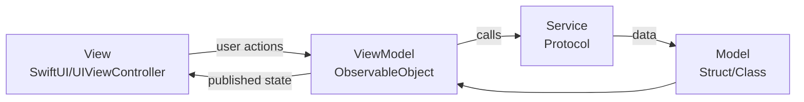

# Architecture — MVC, MVVM & MVP

---

## MVC (Model-View-Controller)

Apple's default pattern. The ViewController mediates between Model and View.

```
Model ←→ Controller ←→ View
```

```swift
// MVC — classic UIKit
class UserListViewController: UIViewController {
    // Model
    var users: [User] = []
    
    // View
    @IBOutlet weak var tableView: UITableView!
    
    override func viewDidLoad() {
        super.viewDidLoad()
        loadUsers()
    }
    
    private func loadUsers() {
        UserService.shared.fetchUsers { [weak self] result in
            DispatchQueue.main.async {
                switch result {
                case .success(let users):
                    self?.users = users
                    self?.tableView.reloadData()
                case .failure(let error):
                    self?.showError(error)
                }
            }
        }
    }
}
```

### The Massive View Controller Problem

In MVC, ViewControllers accumulate:
- Networking code
- Data transformation
- State management
- Navigation logic
- Delegate implementations
- Analytics tracking

This leads to ViewControllers with 1000+ lines — hard to test, hard to read.

> 🎯 **Interview Answer:** "MVC suffers from 'Massive View Controller' syndrome because the Controller ends up as a catch-all for anything that doesn't fit in Model or View. Networking, state management, transformation, and navigation all land there. The solution is to extract responsibilities: networking into a service layer, transformation into a ViewModel, navigation into a Coordinator."

---

## MVVM (Model-View-ViewModel)

The most popular architecture for modern iOS. The ViewModel exposes state and handles business logic; the View just renders.

```
Model ←→ ViewModel ←→ View
         (business logic,  (renders,
          data transform,   observes VM,
          state mgmt)       sends actions)
```

```swift
// ViewModel — no UIKit imports, fully testable
@MainActor
final class UserListViewModel: ObservableObject {
    @Published private(set) var users: [User] = []
    @Published private(set) var isLoading = false
    @Published private(set) var errorMessage: String?
    
    private let userService: UserServiceProtocol
    
    init(userService: UserServiceProtocol = UserService()) {
        self.userService = userService
    }
    
    func loadUsers() async {
        isLoading = true
        errorMessage = nil
        
        do {
            users = try await userService.fetchUsers()
        } catch {
            errorMessage = error.localizedDescription
        }
        isLoading = false
    }
    
    func deleteUser(at indexSet: IndexSet) async {
        let idsToDelete = indexSet.map { users[$0].id }
        users.remove(atOffsets: indexSet)
        for id in idsToDelete {
            try? await userService.deleteUser(id: id)
        }
    }
}

// SwiftUI View — purely presentational
struct UserListView: View {
    @StateObject private var viewModel = UserListViewModel()
    
    var body: some View {
        Group {
            if viewModel.isLoading {
                ProgressView()
            } else {
                List {
                    ForEach(viewModel.users) { user in
                        UserRow(user: user)
                    }
                    .onDelete { indexSet in
                        Task { await viewModel.deleteUser(at: indexSet) }
                    }
                }
            }
        }
        .alert("Error", isPresented: .constant(viewModel.errorMessage != nil)) {
            Button("OK") { }
        } message: {
            Text(viewModel.errorMessage ?? "")
        }
        .task { await viewModel.loadUsers() }
    }
}
```

### MVVM with UIKit + Combine

```swift
final class UserListViewModel {
    @Published private(set) var users: [User] = []
    @Published private(set) var isLoading = false
    
    private var cancellables = Set<AnyCancellable>()
    private let userService: UserServiceProtocol
    
    init(userService: UserServiceProtocol) {
        self.userService = userService
    }
    
    func viewDidLoad() {
        loadUsers()
    }
    
    private func loadUsers() {
        isLoading = true
        userService.fetchUsersPublisher()
            .receive(on: DispatchQueue.main)
            .sink(
                receiveCompletion: { [weak self] _ in self?.isLoading = false },
                receiveValue: { [weak self] users in self?.users = users }
            )
            .store(in: &cancellables)
    }
}

// UIKit ViewController binds to ViewModel
class UserListViewController: UIViewController {
    private var viewModel: UserListViewModel!
    private var cancellables = Set<AnyCancellable>()
    
    override func viewDidLoad() {
        super.viewDidLoad()
        bindViewModel()
        viewModel.viewDidLoad()
    }
    
    private func bindViewModel() {
        viewModel.$users
            .receive(on: DispatchQueue.main)
            .sink { [weak self] _ in self?.tableView.reloadData() }
            .store(in: &cancellables)
        
        viewModel.$isLoading
            .receive(on: DispatchQueue.main)
            .sink { [weak self] loading in
                loading ? self?.activityIndicator.startAnimating()
                        : self?.activityIndicator.stopAnimating()
            }
            .store(in: &cancellables)
    }
}
```

### MVVM Diagram



---

## MVP (Model-View-Presenter)

Similar to MVVM but the Presenter holds a reference to the View via a protocol — making the View completely passive.

```swift
// View protocol — the Presenter talks to this
protocol UserListViewProtocol: AnyObject {
    func showUsers(_ users: [User])
    func showLoading(_ loading: Bool)
    func showError(_ message: String)
}

// Presenter — knows the view protocol but not UIKit
final class UserListPresenter {
    weak var view: UserListViewProtocol?
    private let userService: UserServiceProtocol
    
    init(userService: UserServiceProtocol) {
        self.userService = userService
    }
    
    func viewDidLoad() {
        view?.showLoading(true)
        Task {
            do {
                let users = try await userService.fetchUsers()
                await MainActor.run {
                    view?.showUsers(users)
                    view?.showLoading(false)
                }
            } catch {
                await MainActor.run {
                    view?.showError(error.localizedDescription)
                    view?.showLoading(false)
                }
            }
        }
    }
}

// ViewController conforms to view protocol
class UserListViewController: UIViewController, UserListViewProtocol {
    var presenter: UserListPresenter!
    
    override func viewDidLoad() {
        super.viewDidLoad()
        presenter.viewDidLoad()
    }
    
    func showUsers(_ users: [User]) { /* update table */ }
    func showLoading(_ loading: Bool) { /* toggle indicator */ }
    func showError(_ message: String) { /* show alert */ }
}
```

### MVP vs MVVM

| Aspect | MVVM | MVP |
|--------|------|-----|
| View knows ViewModel? | Yes (observes it) | No (passive) |
| ViewModel knows View? | No | Yes (via protocol) |
| Binding | Combine/@Published | Manual delegation |
| Testability | High | Very high (mock View) |
| Verbosity | Medium | Higher |
| SwiftUI fit | Excellent | Poor |

---

## Interview Q&A

**Q: Why is MVVM preferred over MVC for modern iOS?**  
A: MVVM moves business logic, data transformation, and state management out of the ViewController into the ViewModel — which has no UIKit dependency and is easy to unit test. The ViewController becomes thin: just binding to ViewModel state and forwarding user actions. With SwiftUI and `@StateObject`/`@ObservedObject`, binding is automatic.

**Q: What belongs in the ViewModel vs the View?**  
A: ViewModel: business logic, data fetching, state management, data transformation (User → display string). View: rendering, animations, layout, user input forwarding. The ViewModel should have zero UIKit/SwiftUI imports; the View should have minimal conditional logic.

**Q: What's the key difference between MVVM and MVP?**  
A: In MVP the Presenter holds a reference to a View protocol, making the ViewController a completely passive "display component." In MVVM the View observes the ViewModel (typically via Combine or `@Published`). MVP gives finer control for complex UIKit apps; MVVM fits naturally with SwiftUI's reactive model.

---

## Quick Revision

- MVC: simple, Apple's default, leads to massive ViewControllers
- MVVM: ViewModel is testable, no UIKit; View observes state
- MVP: Presenter holds View protocol reference, View is passive
- MVVM + SwiftUI: `@StateObject` / `@ObservedObject` for binding
- MVVM + UIKit: Combine `@Published` + `sink` bindings
- Rule: ViewModel has no UIKit/SwiftUI imports
