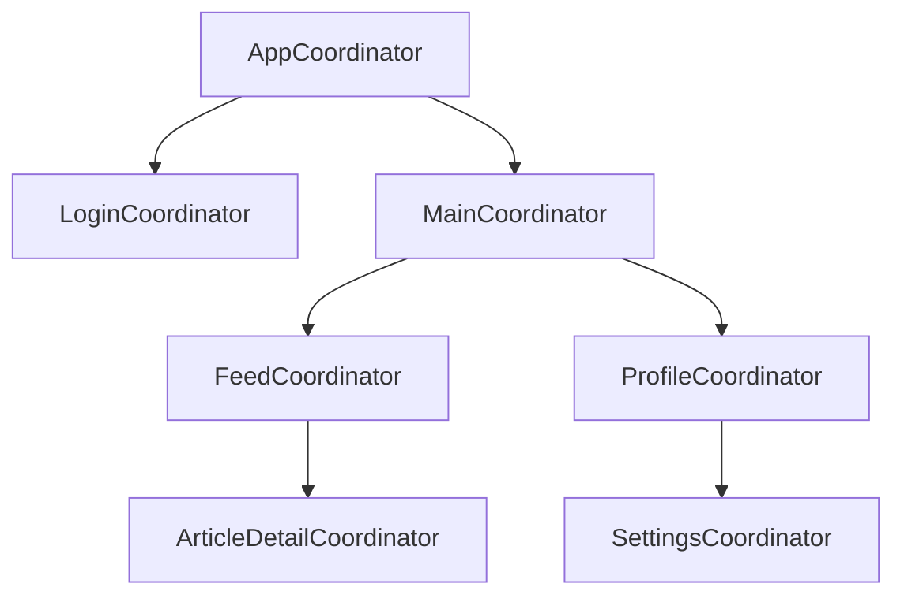

# Architecture — Coordinator Pattern

The Coordinator pattern removes navigation logic from ViewControllers, making them reusable and navigation flows testable.

---

## The Problem

```swift
// ❌ Navigation embedded in ViewController
class LoginViewController: UIViewController {
    func loginSuccess() {
        // ViewController knows about the whole app structure!
        let tabBar = MainTabBarController()
        let nav = UINavigationController(rootViewController: tabBar)
        view.window?.rootViewController = nav
    }
}
```

ViewControllers become tightly coupled to each other and to the navigation hierarchy. Reusing them elsewhere requires a rewrite.

---

## Basic Coordinator

```swift
// Coordinator protocol
protocol Coordinator: AnyObject {
    var childCoordinators: [Coordinator] { get set }
    var navigationController: UINavigationController { get }
    func start()
}

// App Coordinator
final class AppCoordinator: Coordinator {
    var childCoordinators: [Coordinator] = []
    let navigationController: UINavigationController
    
    private let authService: AuthServiceProtocol
    
    init(navigationController: UINavigationController, authService: AuthServiceProtocol) {
        self.navigationController = navigationController
        self.authService = authService
    }
    
    func start() {
        if authService.isLoggedIn {
            showMain()
        } else {
            showLogin()
        }
    }
    
    private func showLogin() {
        let loginCoordinator = LoginCoordinator(navigationController: navigationController)
        loginCoordinator.delegate = self
        childCoordinators.append(loginCoordinator)
        loginCoordinator.start()
    }
    
    private func showMain() {
        let mainCoordinator = MainCoordinator(navigationController: navigationController)
        childCoordinators.append(mainCoordinator)
        mainCoordinator.start()
    }
}

extension AppCoordinator: LoginCoordinatorDelegate {
    func loginCoordinatorDidFinish(_ coordinator: LoginCoordinator) {
        childCoordinators.removeAll { $0 === coordinator }
        showMain()
    }
}
```

```swift
// Login Coordinator
protocol LoginCoordinatorDelegate: AnyObject {
    func loginCoordinatorDidFinish(_ coordinator: LoginCoordinator)
}

final class LoginCoordinator: Coordinator {
    var childCoordinators: [Coordinator] = []
    let navigationController: UINavigationController
    weak var delegate: LoginCoordinatorDelegate?
    
    init(navigationController: UINavigationController) {
        self.navigationController = navigationController
    }
    
    func start() {
        let vc = LoginViewController()
        vc.coordinator = self
        navigationController.setViewControllers([vc], animated: false)
    }
    
    func showForgotPassword() {
        let vc = ForgotPasswordViewController()
        vc.coordinator = self
        navigationController.pushViewController(vc, animated: true)
    }
    
    func loginDidSucceed() {
        delegate?.loginCoordinatorDidFinish(self)
    }
}
```

### Coordinator Tree



---

## Coordinator with Delegate Pattern

```swift
// ViewController signals coordinator via protocol
class LoginViewController: UIViewController {
    weak var coordinator: LoginCoordinator?
    
    @IBAction func loginTapped() {
        // ViewController has NO idea what happens after login
        coordinator?.loginDidSucceed()
    }
    
    @IBAction func forgotPasswordTapped() {
        coordinator?.showForgotPassword()
    }
}
```

---

## Coordinator with Completion Handlers

Alternative to delegation:

```swift
final class ProfileCoordinator: Coordinator {
    var childCoordinators: [Coordinator] = []
    let navigationController: UINavigationController
    
    func showEditProfile(user: User, completion: @escaping (User?) -> Void) {
        let vc = EditProfileViewController(user: user)
        vc.onSave = { [weak self] updatedUser in
            self?.navigationController.popViewController(animated: true)
            completion(updatedUser)
        }
        vc.onCancel = { [weak self] in
            self?.navigationController.popViewController(animated: true)
            completion(nil)
        }
        navigationController.pushViewController(vc, animated: true)
    }
}
```

---

## Deep Linking with Coordinators

```swift
enum DeepLink {
    case userProfile(userId: String)
    case article(articleId: String)
    case settings
}

protocol DeepLinkHandling {
    func handle(deepLink: DeepLink)
}

extension AppCoordinator: DeepLinkHandling {
    func handle(deepLink: DeepLink) {
        switch deepLink {
        case .userProfile(let id):
            mainCoordinator?.showUserProfile(id: id)
        case .article(let id):
            feedCoordinator?.showArticle(id: id)
        case .settings:
            mainCoordinator?.showSettings()
        }
    }
}

// In SceneDelegate
func scene(_ scene: UIScene, openURLContexts URLContexts: Set<UIOpenURLContext>) {
    guard let url = URLContexts.first?.url,
          let deepLink = DeepLinkParser.parse(url: url) else { return }
    appCoordinator.handle(deepLink: deepLink)
}
```

---

## Interview Q&A

**Q: What problem does the Coordinator pattern solve?**  
A: It removes navigation logic from ViewControllers. Without Coordinator, VCs are tightly coupled to the rest of the app — they know which screen comes next and how to create it. With Coordinator, VCs just signal intent ("login succeeded") and the Coordinator decides what to show. This makes VCs reusable and navigation logic centralized and testable.

**Q: How do child coordinators communicate back to parent coordinators?**  
A: Typically via a delegate protocol. The child defines a delegate protocol; the parent implements it as `weak var delegate`. The child calls delegate methods when it finishes. The parent removes the child coordinator from `childCoordinators` to release it.

**Q: Why keep a `childCoordinators` array?**  
A: Coordinators are reference types (classes) — if nothing holds a strong reference, they're deallocated. Child coordinators need to stay alive as long as their flow is active. The parent's `childCoordinators` array provides that strong reference.

**Q: How does the Coordinator pattern help with deep linking?**  
A: The App Coordinator (or dedicated DeepLinkHandler) receives the parsed deep link and calls the appropriate child coordinator's navigation method. Navigation logic is centralized — you don't need to send notifications or use singletons. The coordinator tree can reconstruct state to show the right screen.

---

## Quick Revision

- Coordinator: removes navigation logic from ViewControllers
- VCs signal intent via delegate/closure; coordinator decides navigation
- `childCoordinators`: strong-reference array keeps child alive
- Delegate protocol: child notifies parent when flow completes
- Parent removes child from `childCoordinators` when done (prevents memory leak)
- Deep linking: parse URL → `DeepLink` enum → AppCoordinator routes to correct flow
- Mermaid diagram: AppCoordinator → Login/Main → Feature coordinators
