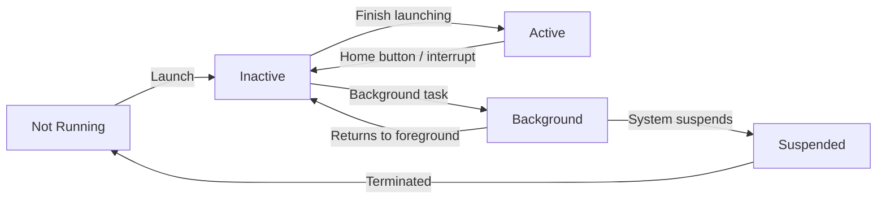

# App Lifecycle — App & Scene Lifecycle

---

## App State Machine



| State | Description |
|-------|-------------|
| Not Running | App not launched or terminated |
| Inactive | Foreground but not receiving events (call, control center) |
| Active | Foreground, receiving events — normal state |
| Background | App code executing but not visible |
| Suspended | In memory, no code executing — system may terminate |

---

## AppDelegate

`AppDelegate` handles app-level lifecycle events:

```swift
@main
class AppDelegate: UIResponder, UIApplicationDelegate {
    
    // App finished launching — one-time setup
    func application(
        _ application: UIApplication,
        didFinishLaunchingWithOptions launchOptions: [UIApplication.LaunchOptionsKey: Any]?
    ) -> Bool {
        // Check if launched from notification
        if let notification = launchOptions?[.remoteNotification] as? [String: AnyObject] {
            handleLaunchNotification(notification)
        }
        
        setupCrashReporting()
        setupAnalytics()
        
        return true
    }
    
    // App going to background
    func applicationDidEnterBackground(_ application: UIApplication) {
        saveApplicationState()
        scheduleBackgroundRefresh()
    }
    
    // App returning to foreground
    func applicationWillEnterForeground(_ application: UIApplication) {
        refreshStaleData()
    }
    
    // App becoming active
    func applicationDidBecomeActive(_ application: UIApplication) {
        UIApplication.shared.applicationIconBadgeNumber = 0  // Clear badge
        resumeTimers()
    }
    
    // App resigning active (incoming call, control center, etc.)
    func applicationWillResignActive(_ application: UIApplication) {
        pauseTimers()
        saveCurrentState()
    }
    
    // App about to terminate (not always called — usually suspended first)
    func applicationWillTerminate(_ application: UIApplication) {
        saveApplicationState()
    }
    
    // Remote notification registration
    func application(_ application: UIApplication,
                     didRegisterForRemoteNotificationsWithDeviceToken deviceToken: Data) {
        let token = deviceToken.map { String(format: "%02x", $0) }.joined()
        NotificationService.shared.registerDeviceToken(token)
    }
    
    func application(_ application: UIApplication,
                     didFailToRegisterForRemoteNotificationsWithError error: Error) {
        print("Push registration failed: \(error)")
    }
}
```

---

## SceneDelegate (iOS 13+)

Multi-scene support allows one app to have multiple windows (especially on iPad):

```swift
class SceneDelegate: UIResponder, UIWindowSceneDelegate {
    var window: UIWindow?
    
    // Scene connected (first time or reconnected from memory)
    func scene(_ scene: UIScene, willConnectTo session: UISceneSession,
               options connectionOptions: UIScene.ConnectionOptions) {
        guard let windowScene = scene as? UIWindowScene else { return }
        
        window = UIWindow(windowScene: windowScene)
        window?.rootViewController = MainViewController()
        window?.makeKeyAndVisible()
        
        // Handle connection from URL (deep link at launch)
        if let urlContext = connectionOptions.urlContexts.first {
            handleURL(urlContext.url)
        }
        
        // Handle notification at launch
        if let response = connectionOptions.notificationResponse {
            handleNotification(response)
        }
    }
    
    // Scene going to background
    func sceneDidEnterBackground(_ scene: UIScene) {
        // Save data, stop timers
    }
    
    // Scene returning to foreground
    func sceneWillEnterForeground(_ scene: UIScene) {
        // Refresh data
    }
    
    // Scene becoming active
    func sceneDidBecomeActive(_ scene: UIScene) {
        // Resume operations
    }
    
    // Scene resigning active
    func sceneWillResignActive(_ scene: UIScene) {
        // Pause operations
    }
    
    // Handle URL opened while app running
    func scene(_ scene: UIScene, openURLContexts URLContexts: Set<UIOpenURLContext>) {
        guard let url = URLContexts.first?.url else { return }
        handleURL(url)
    }
    
    // Handle universal link while app running
    func scene(_ scene: UIScene, continue userActivity: NSUserActivity) {
        guard userActivity.activityType == NSUserActivityTypeBrowsingWeb,
              let url = userActivity.webpageURL else { return }
        handleUniversalLink(url)
    }
}
```

### AppDelegate vs SceneDelegate Division

| Responsibility | AppDelegate | SceneDelegate |
|---------------|-------------|---------------|
| One-time app setup | ✅ | |
| Push token registration | ✅ | |
| Background fetch | ✅ | |
| Window management | (pre-iOS 13) | ✅ |
| Deep link handling | | ✅ |
| Scene-specific lifecycle | | ✅ |

> 🎯 **Interview Answer:** "AppDelegate was the single entry point for all lifecycle events before iOS 13. With iOS 13, Apple introduced SceneDelegate to support multiple windows on iPad. Now AppDelegate handles app-level concerns (one-time setup, push token registration, background processing) while SceneDelegate manages window and scene-level lifecycle (URL handling, notification responses, window creation)."

---

## State Restoration

```swift
// Encode state when app goes to background
class ViewController: UIViewController {
    override func encodeRestorableState(with coder: NSCoder) {
        super.encodeRestorableState(with: coder)
        coder.encode(currentItemID, forKey: "itemID")
        coder.encode(scrollOffset, forKey: "scrollOffset")
    }
    
    override func decodeRestorableState(with coder: NSCoder) {
        super.decodeRestorableState(with: coder)
        currentItemID = coder.decodeObject(forKey: "itemID") as? String
        scrollOffset = coder.decodeDouble(forKey: "scrollOffset")
    }
}
```

---

## Interview Q&A

**Q: What are the five app states in iOS?**  
A: Not Running (not launched or terminated), Inactive (foreground but not receiving events — during interruptions like calls), Active (foreground, receiving events), Background (code executing but not visible — brief window after pressing Home), Suspended (in memory, no CPU — system may terminate without notice).

**Q: When is `applicationWillTerminate` called?**  
A: Rarely — most apps are suspended and then silently terminated when the system needs memory. `willTerminate` is called when the user force-quits the app, or when the app is in the background and the system needs to terminate it for some specific reason. Don't rely on it for critical saves; use `didEnterBackground` instead.

**Q: What is the difference between Inactive and Background states?**  
A: Inactive is a transient state — the app is still in the foreground but temporarily not receiving events (phone call overlay, notification banner, Siri, app switcher). Background means the app is fully backgrounded — the UI isn't visible and there's a brief execution window. Inactive transitions to either Active (interruption dismissed) or Background (user navigated away).

---

## Quick Revision

- 5 states: Not Running → Inactive → Active → Background → Suspended
- AppDelegate: one-time setup, push token, background fetch scheduling
- SceneDelegate (iOS 13+): window, deep links, per-scene lifecycle
- `didEnterBackground`: save state here (reliable)
- `willTerminate`: unreliable — don't depend on it for saves
- Multi-scene: iPad supports multiple windows, each gets a SceneDelegate
- State restoration: `encodeRestorableState` / `decodeRestorableState`
