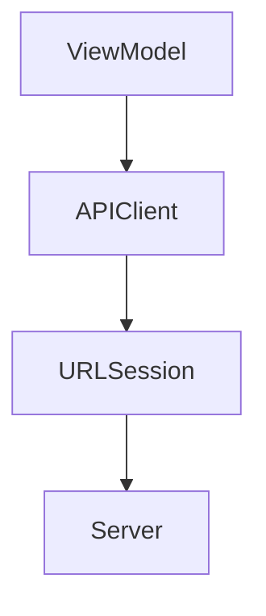

# URLSession and API Client Design

## URLSession

Apple's networking API.

```swift
let (data, response) = try await URLSession.shared.data(for: request)
```

## API Client Flow



## API Error Modeling

```swift
enum APIError: Error {
    case invalidURL
    case network(Error)
    case invalidResponse
    case statusCode(Int)
    case decoding(Error)
}
```

## Why This Matters

Clear boundaries, testability, maintainability.

## Interview Answer

I prefer API client abstraction with async/await, strong error modeling, and decodable generic request handling.
