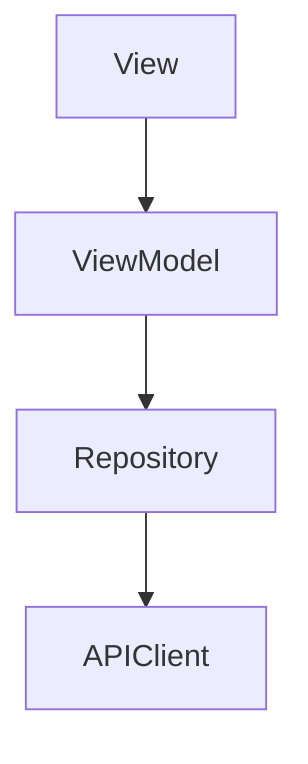

# MVVM, Repository, and Dependency Injection

# MVVM

Model-View-ViewModel separates UI rendering from business logic.



## Why MVVM?

- testability
- separation of concerns
- cleaner view controllers

# Repository Pattern

Repository abstracts data source complexity.

```swift
protocol UserRepository {
    func fetchUsers() async throws -> [User]
}
```

ViewModel depends on abstraction, not concrete networking.

# Dependency Injection

Inject dependencies externally.

```swift
init(repository: UserRepository)
```

Benefits:
- easier testing
- loose coupling
- replaceable implementations

## Interview Answer

MVVM improves UI separation. Repository abstracts persistence/networking. Dependency injection reduces coupling and improves testability.
