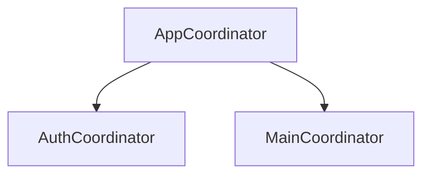

# Coordinators and Clean Architecture

# Coordinator Pattern

Separates navigation from view controllers.



Benefits:
- cleaner navigation ownership
- reusable flows
- better testability

# Clean Architecture

Layered separation.

```text
Presentation
Use Cases
Repositories
Infrastructure
```

Benefits:
- scalability
- maintainability
- clearer boundaries

Tradeoff:
May be overkill for small apps.

## Interview Answer

Use architecture proportionally. MVVM + Repository + DI often provides practical balance, while Clean Architecture helps larger complex systems.
